# CA-LegalGate（律核）· 三通道异构法律问答路由系统

> **一句话定义**：CA-LegalGate 是一个**免训练**的中文法律问答系统，用"确定性结构化通道 +
> 门控式直接生成 + 门控式语义检索"三条异构通道，在**不牺牲准确率**的前提下把检索调用
> 压下来，并把每一次路由决策、每一条法条来源、每一个案号核验结论都写进可审计的 `trace`。
>
> **"不牺牲准确率"的证据状态（2026-09-12，D33/D34）**：E1 主对比在 **test 全量 944 条**
> （回答=DeepSeek API `deepseek-v4-flash`、门控草稿=本机 Qwen2.5-0.5B、192 tokens、机械代理判分）上，
> 本系统 acc **0.6144** vs Always-RAG **0.5551**（配对 Wilcoxon p=0.00205，Holm 校正后显著**更优**），
> 同时检索调用率 **0.09**（降 91%）——核心断言 **PASS**（`results/e1/core_assertion.json`）。
> 该表述曾在 D32-1 因旧口径证据（1.5B/tok80/dev_calib 工作点）被**禁用**，现按新口径全量证据恢复；
> 引用时必须带口径三件套，且不得与 `results/_archive/2026-09-11_qwen1.5b_tok80/` 的旧数字并排。

---

## 0. 本仓库当前状态（诚实清单）

| 项目 | 状态 | 证据 |
|---|---|---|
| 可运行系统（路由 + 三通道 + 前端） | ✅ 可运行（历史：2026-09-11 端到端冒烟 20/20，脚本与报告已于 2026-09-16 删除，见 D37） | `lawgate/router.py`、`lawgate/api/ui.py`；组件级自检 `docs/quickcheck.txt`（意图 6/6、核验 6/6） |
| 全部实验与验收脚本（E0–E6 / 消融 / 校准 / 出图 / 冒烟） | ✅ 已实现，可运行 | `scripts/` 共 **30** 个可复现脚本（口径 = 名字不以 `_` 开头的 `.py`），清单见 §3；一次性探针已归档进 `scripts/_archive/2026-09-13_probes/` |
| 知识库（法条 + 案号 + 沿革 + 词典） | ⚠️ 可运行但**非官方原文** | 158 行 / 95 条，全部 `MANUAL_TRANSCRIPT` + `PENDING_FLK_VERIFICATION`；案号库 600 条全部 `SYNTHETIC` |
| 向量库 | ✅ 已构建 | `data/kb/vector_build.json`：1295 文档、512 维、chromadb、37.8 s |
| 评测集（1180 条） | ✅ 已构建并通过自校验 | `data/benchmark/verify_report.md` 结论 **PASS** |
| E0 门控信号诊断 | ⚠️ 已完成，但**信号采集在 0.5B 上**（D21） | `figures/e0/e0_auc.json`（**红灯 → 已按桶改混合路由**）；1.5B 复测：`--tag 15b` 分片顺序跑 `--split dev` + `--merge` + `--analyse-only`，`--tag 15b_calib` 单次跑 `--split dev_calib`（**D22**：`--split` 只收单值，两 split 分目录避免互覆 `e0_auc.json`） |
| E6 案号核验 | ✅ 已完成 | `results/e6/prf.json`、`results/e6/confusion.json` |
| E1 主对比 / E2 消融 / E3 多轮 / E5 时效陷阱 | ✅ **已完成（2026-09-12，新口径）** —— E1 跑满 **test 全量 944**（D33），E2 四组 15 变体（test_e1 300）、E3（test_e4 60）、E5（temporal_trap 120）全部落盘；所有记录经 D34 判分修复后**统一离线重判**（原件备份 `results/_prescore_backup/`，两轮报告 `docs/rescore_report*.md`） | `results/e1/summary.csv` + `core_assertion.json`（**PASS**：acc 0.6144 vs 0.5551、RR 0.09）、`results/e2/ablation_rows.json`、`results/e3/e3_report.json`（**负结果**，见 D35）、`results/e5/tvc_by_trap.json`（TVC 0.9333 vs 0.35）。2026-09-11 的旧口径（1.5B/tok80）残留分片已移入 `results/_archive/`，**不得与新数字并排引用** |
| 三通道端到端冒烟（S3） | ⚰️ 历史 20/20（2026-09-11）；脚本与产物已于 2026-09-16 删除（用户要求，见 D37），现以 `docs/quickcheck.txt` 为可复跑自检 | `scripts/smoke.py` 曾 20/20 走真实 `POST /chat`（首轮 14/20，6 组失败定位到 **D26** 四个缺陷，已修复复测 20/20）。删除后 S3 回归改跑 `scripts/quickcheck.py` + `scripts/check_stream.py` |
| 桶级阈值校准 | ✅ **已完成并按新口径重校准（2026-09-12，D33-3）** | `configs/thresholds.json`：b1 0.29 / b2 1.0 / b3 1.0 / **b4 1.0**（`dev_calib` 144 条、新口径 dev 基线重跑后校准、`largest_feasible`、`grid_max=1.0`，见 `results/calibrate_report.json`；b1 仍 `feasible:false` → 0.29 为兜底值，D13 口径披露；D30 的"τ_b 未重校准"警告**解除**） |
| 人工标注 / 真实标注者 κ | ❌ **未做**（本环境无标注员） | 所有标签为规则化生成；`kappa_report.md` 的 κ 来自**模拟**标注员，**不得**当作一致性证据 |
| 真实裁判文书（裁判文书网） | ❌ **未做** | 网络中间层劫持，且合成库无法测"假阴性" |
| FLK 官方法律原文 | ❌ **未做** | 见 `docs/DATA_GAP.md` |
| 最终回答模型 | ✅ **DeepSeek 官方 API 的 `deepseek-v4-flash`**（默认，关思考，单条 192 token 约 **1–3 s**，缓存命中 ≈0.05 s） | `configs/base.yaml: llm_backend: deepseek` / `deepseek_model`；密钥在仓库根 **`.env` 的 `DEEPSEEK_API_KEY`**（不提交，已 `.gitignore`）；真机自检 `scripts/check_deepseek.py --live`（D30） |
| 门控草稿来源 | ✅ **本机 Qwen2.5-0.5B**（默认；API 草稿的 u 实测塌缩到 ≈0，不可用作默认） | `configs/base.yaml: draft_source: auto`；来源与每次尝试写进 `trace.draft_source` / `draft_attempts`；对照实测见 `docs/check_deepseek_gate.txt`（D30） |
| GPU / 7B 模型 | ❌ **无 GPU；权重规模已不是瓶颈** | 本机无 CUDA。历史口径：0.5B（HF 缓存）→ 1.5B（D21）→ 6.7B 本地 `models/fuzi-mingcha-v1_0`（D29）；**现在 6.7B 只作离线兜底**，默认由 DeepSeek API 回答（D30）。⚠️ 早期 pilot/timing/E0 信号为 0.5B、E1 为 1.5B 产物，口径不同，引用必须区分 |

> 逐条偏差记录（**D0–D36**）见 **`docs/deviations.md`**；验收判定见 **`docs/ACCEPTANCE.md`**（已生成，反映当前真实状态）；
> 零基础收尾总结见 **`docs/最终总结_小白版.md`**（大白话版结论、验收对照、诚实清单、5 分钟自查）。
> **申报/论文相关**：可行性判断与路线见 **`docs/大创与论文可行性评估.md`**（含大创立项、论文分档、"效力盲 + 检索冗余"新卖点、答辩十问与口径修正清单），
> 申报书填空模板见 **`docs/大创申报书骨架.md`**。两份文档是 2026-09 对照真实产物（`results/`、`counts.json`）核对后的判断，**引用数字时以它们列为依据的文件为准**。

---

## 1. 快速开始（PowerShell，从克隆到跑通演示）

> 零基础读者建议先读 **`docs/小白复现指南.md`**：每一步"做什么、为什么、产物怎么验收"
> 都有大白话解释，光看它即可复现整个项目。

```powershell
# 0) 进入仓库
cd D:\桌面\lawgate

# 1) 环境变量（三项都必须）
#    KMP_DUPLICATE_LIB_OK : Anaconda MKL 与 torch 同时链接 libiomp5md.dll，
#                           不设会直接崩；lawgate/__init__.py 里也做了 setdefault。
#    TOKENIZERS_PARALLELISM: 关闭分词器并行，避免 fork 警告风暴。
#    HF_HUB_OFFLINE       : 本环境 huggingface_hub(httpx) 证书校验失败（D0），强制离线走本地缓存。
#                           ⚠️ 它只约束**权重下载**，不影响 DeepSeek API 调用（见下方"环境变量与 .env"）。
$env:KMP_DUPLICATE_LIB_OK   = "TRUE"
$env:TOKENIZERS_PARALLELISM = "false"
$env:HF_HUB_OFFLINE         = "1"

# 2) 建知识库（法条 + 案号真值库 + 沿革 + 词典）
#    产物：data/kb/legal_facts.db、data/raw/*.txt、data/kb/qa_report.md、data/kb/build_summary.json
python -m lawgate.knowledge.build_sqlite

# 3) 建向量库（法条按"条"聚合 + 文书 300/50 分块 → bge 编码 → chromadb）
#    产物：data/kb/chroma/、data/kb/vector_build.json
python -m lawgate.knowledge.build_vector

# 4) 链路自检（意图 / 时效状态机 / 案号核验 / 通道 B 端到端）
#    ⚠️ 控制台是 GBK，中文输出会乱码 —— 只看退出码，内容去 docs/quickcheck.txt 看
python scripts/quickcheck.py

# 5) 构建评测集（1180 条，seed=42），并校验
python scripts/build_benchmark.py
python scripts/build_benchmark.py --verify

# 6) E0 门控信号诊断（决定路由方案；dev 集 236 条，k=20 草稿）
python scripts/e0_diagnostic.py --split dev
#    换模型复测（D21）时加 --tag，产物进 figures/e0_<tag>/，不覆盖已有 E0 结果：
#      python scripts/e0_diagnostic.py --split dev --tag 15b \
#        --shard 0 --nshards 6      # 分片顺序跑 0..5，再 --merge，最后 --analyse-only
#    ⚠️ E0 与 E1 **不能同时跑**：两者各占 ≈6 GB 常驻内存 + 全部 18 核，
#       并行时实测 E1 从 9.3 s/条 掉到 15 s/条（总产出没有变快），可用内存只剩 ~4 GB。
#       正确顺序：E1 流水线跑完 → 再跑 E0。2026-09-11 就是按这个顺序做的。

# 7) 一键跑完剩余实验（dev 基线 → 校准 → E1 → E5 → E6 → E3 → E2 → 出图）
#    这一步很慢：生成成本由**后端**决定 —— 走 DeepSeek API 时单条 192 token 约 1–3 s，
#    走本机权重（$env:LAWGATE_LLM_PROVIDER="hf"）时才回到「CPU 上 80-token 约 12–15 s/条」。
#    建议按下面的方式长跑。
python scripts/run_pipeline.py --max-tokens 80 --threads 14

# 8) 启动演示界面（Gradio 双栏 + Trace 面板）→ http://127.0.0.1:7860
python -m lawgate.api.ui

# 8') 或者启动 FastAPI 服务（端口见下方说明）
python -m lawgate.api.app --port 8010

# 9) 三通道端到端冒烟（原 scripts/smoke.py，2026-09-16 已删除，见 D37）：
#    历史 20/20（首轮 14/20，暴露 D26 四缺陷已修复）。现回归改跑 quickcheck + check_stream。

# 10) 流式输出自检（**离线，秒级**，不需要权重；见 D28-2）
python scripts/check_stream.py               # → docs/check_stream.txt
#     事件序列 / answer() 与 answer_stream() 同源一致性 / SSE 帧协议 / 中文编码 / 异常成帧

# 11) 流式输出**真机**冒烟（原 scripts/smoke_stream.py，2026-09-16 已删除，见 D37）：
#     历史断言：真·逐片（API 后端判据「≥5 片且首末片跨度 ≥50 ms」、流式≡整段（缓存互通）、
#     UI 渐进刷新、SSE 帧序列、两栏 token 上限 192/192（D30-3d/e）。
#     现替代：离线 check_stream.py + 真机 check_deepseek.py --live / check_fuzi_e2e.py。

# 12) DeepSeek API 自检（先跑离线段：不联网、不花钱；加 --live 才打真机）
E:\Anaconda\python.exe scripts\check_deepseek.py                  # 离线段 → docs/check_deepseek.txt
E:\Anaconda\python.exe scripts\check_deepseek.py --live            # 真机段 → docs/check_deepseek_live.txt
E:\Anaconda\python.exe scripts\check_deepseek.py --skip-offline --live --with-local-draft
#     最后一条 = 门控新旧对照（API 草稿 vs 本机 0.5B 草稿的 u 分布），产物 docs/check_deepseek_gate.txt；
#     τ_b 已按新草稿源重校准（2026-09-12，D33-3）；换回答/草稿后端后仍应重跑它看 u 分布再重校准。
```

### 环境变量与 `.env`（D30 起 `.env` 真的被读）

`lawgate/env_setup.py` 的 `apply()`（被 `import lawgate` 自动调用）会**顺带读一次仓库根的 `.env`**，
所以密钥与开关写在 `.env` 里即生效，不必每个终端手工 `$env:`（历史上必须手工设，导致换终端就"莫名 401"）。

| 变量 | 作用 | 默认 |
|---|---|---|
| `DEEPSEEK_API_KEY` | DeepSeek 密钥（**只存在于 `.env`/环境变量，`.gitignore` 已排除 `.env`；代码与配置从不写明文**） | 无（缺失会 401） |
| `DEEPSEEK_BASE_URL` | API 地址 | `https://api.deepseek.com` |
| `DEEPSEEK_MODEL` | 回答模型名（`configs/base.yaml: deepseek_model` 是同一个值的非密配置） | `deepseek-v4-flash` |
| `LAWGATE_LLM_PROVIDER` | 服务形态：`deepseek` / `hf` / `rule`（覆盖 `base.yaml: llm_backend`） | 按 `llm_backend` |
| `LAWGATE_LLM_THINKING` | 思考模式：留空/`0`=关（默认，快且正文非空）；设 `1`=开 | 关 |
| `LAWGATE_LLM_TIMEOUT` | 单次请求超时（秒） | `120` |
| `LAWGATE_LLM_RETRIES` | 失败重试次数（429/5xx/超时才重试） | `3` |
| `LAWGATE_DRAFT_SOURCE` | 门控草稿来源：`auto`（local→api→rule）/ `local` / `api` / `none` | `auto` |
| `LAWGATE_DRAFT_MODEL` | 草稿模型路径；设 `none` = 不加载任何本地草稿模型 | 自动挑 Qwen2.5-0.5B |
| `LAWGATE_DOTENV` | 设 `0` = **完全不读 `.env`**（用于复现"没有密钥时的降级行为"） | `1` |
| `LAWGATE_MODEL` / `LAWGATE_EMBED` / `LAWGATE_DTYPE` | 本地兜底回答模型 / 向量模型 / 精度 | 按 `base.yaml` |

> **优先级**：**真实环境变量 > `.env`**（已存在的变量绝不被覆盖），所以命令行与 `启动服务.ps1 -LlmBackend`
> 的临时覆盖永远说了算。`.env` **含密钥，不要外传、不要提交**。

> ⚠️ **联网口径（重要，别写错）**：`configs/base.yaml` 的 `allow_network: false`
> 现在**只约束 HuggingFace 权重下载**（本环境对 HF 有中间层劫持，D0），
> **不是"禁止一切运行时联网"**——**DeepSeek API 调用是设计内的网络行为**，
> 走不走 API 由 `llm_backend` 决定，不受 `allow_network` 控制。

### 流式输出（默认走 API：生成 1–3 s，"首字"≈取门控草稿的 1.5–3 s；本机权重下才是十几秒白屏）

| 入口 | 形式 | 说明 |
|---|---|---|
| Gradio 双栏界面 | **两栏同时流式** | `lawgate/api/ui.py` 的 `respond_stream`：左栏在后台线程写队列，右栏按事件推进，两栏同时长出来；**两栏生成长度上限统一为 192 token**（`-UiMaxTokens` / `LAWGATE_UI_MAXTOK` 可调，两栏一起变），对照才公平（见 D28-3） |
| `POST /chat/stream` | SSE | `event: stage` → `delta`* → `done`（异常以 `event: error` 收尾）；`done.answer` 是权威全文 |
| `POST /chat` | 一次性 JSON | **行为未变**（评测/E1–E6 走这条），与流式版共用同一份路由决策；生成上限同为 192 token（`RouterOptions` 默认） |

命令行看流式：

```powershell
curl.exe -N -X POST http://127.0.0.1:8010/chat/stream `
  -H "Content-Type: application/json" `
  -d '{"query":"《合同法》第52条规定哪些情形合同无效？"}'
```

> 诚实口径：**通道 B 没有 token 流**（它是查库拼装，整段一次性 `delta`，不假装逐字打字）；
> `delta` 只是增量，最终以 `done.answer` 收口。细节见 `docs/deviations.md` D28。

### 一键起服务（演示/答辩用，推荐）

不做实验、只要把系统跑起来给别人看时，用仓库根目录的两个脚本（双击 `.bat` 即可）：

| 脚本 | 作用 |
|---|---|
| `启动服务.bat` / `启动服务.ps1` | 一键拉起 **Gradio 界面**（http://127.0.0.1:7860）与 **FastAPI 服务**（http://127.0.0.1:8010/docs）；带就绪探测、崩溃自动重启（每服务上限 5 次）、Ctrl+C 一并停掉 |
| `检查状态.ps1` | 一键诊断：端口占用者、两个服务的 HTTP 探活、`/health` 里的**实际生效模型**、知识库/权重是否齐全、E1–E6 产物是否已落盘 |

```powershell
# 只起界面（不起 API）
powershell -ExecutionPolicy Bypass -File .\启动服务.ps1 -NoApi
# 换 API 端口（默认 8010）
powershell -ExecutionPolicy Bypass -File .\启动服务.ps1 -ApiPort 8020
# 离线演示：临时切回本机 fuzi-mingcha 权重（不走 DeepSeek API）
powershell -ExecutionPolicy Bypass -File .\启动服务.ps1 -LlmBackend hf
```

### 默认回答模型与"切回本地"（D30）

| 项 | 默认（当前配置） | 切回本机权重 |
|---|---|---|
| 服务形态 | **DeepSeek 官方 API**（`configs/base.yaml: llm_backend: deepseek`） | `启动服务.ps1 -LlmBackend hf`，或 `$env:LAWGATE_LLM_PROVIDER="hf"` |
| 模型 | **`deepseek-v4-flash`**（服务端回报 `model=deepseek-flash`），地址 `https://api.deepseek.com` | `models/fuzi-mingcha-v1_0`（夫子·明察 6.7B，fp16/CPU） |
| 密钥 | 仓库根 **`.env` 的 `DEEPSEEK_API_KEY`**（不提交，`.gitignore` 已排除；`/health`、`check_backend.py` 只报"有没有"） | 不需要密钥 |
| 单条 192 token | 约 **1–3 s**；命中内容缓存（`data/kb/gen_cache.db`）≈ **0.05 s** | 约 **2–4 分钟**（约 1 token/s） |
| 联网 | **必须**（每问一次 HTTPS；缓存命中则 0 请求） | 完全离线 |
| 思考模式 | 默认**关**（`LAWGATE_LLM_THINKING`，默认空=关） | 不适用 |

> ⚠️ 思考模式**开着**时，模型会先生成一大段 reasoning；`max_tokens` 小时正文会是**空字符串**
> （实测 `max_tokens=32` 时 content 为空、600 token 全被 reasoning 吃掉）——这是实测踩过的坑，
> 所以答案默认关思考（`{"thinking": {"type": "disabled"}}`）。
> 门控草稿会**单独**强制走思考模式取 logprobs（不这样就取不到真实分布），见 `docs/deviations.md` D30-1。

**为什么 API 模式下首次提问仍然要等**：回答本身只要 1 s 左右，但那之前要先取一次**门控草稿**，
而草稿默认来自**本机 Qwen2.5-0.5B**（约 1.5–3 s，实测 3.3 s 里 2.4 s 是草稿）。
想更快可以把 `k_draft` 从 20 降到 8（信号聚合只用前 8 位，**u 不变**），草稿耗时约砍半。

**为什么草稿不用 API 自己的 logprobs**：实测 API 的 logprobs 格式合法，但拿到的是
**套路化推理前缀**的分布（平均裕度 9–11 nats），算出的 u 全挤在 **0.0000–0.0012**，
失去区分度；本机 0.5B 草稿的 u 有量级差异（0.016 / 0.026 / **0.363** / 0.079）。
所以默认链是 **本机 0.5B → API → 确定性伪分布**，每次换源都写进
`trace.draft_source` / `draft_attempts`（见 D30-2）。

```powershell
# 秒级确认"现在到底是谁在回答、草稿从哪来"（不加载权重）
E:\Anaconda\python.exe scripts\check_backend.py
```

**为什么 API 默认端口是 8010 而不是手册/上面写的 8000**：本机 8000 已被
`D:\桌面\心理`（「心语 · 多模态情绪关怀助手」）的后端 Python 进程长期占用。
那是**另一个项目**的服务，本项目不去杀它，只让开端口；需要 8000 时用 `-ApiPort 8000`
并先确认该端口空闲（`检查状态.ps1` 会显示占用者）。

几个实测要点（2026-09-11 本机；标注 D30 的两条为换 API 后复测）：
* 服务**惰性加载**：API 模式下不再加载 13 GB 权重，首次提问只需加载向量库
  （**草稿模型 Qwen2.5-0.5B 仍是首次提问才加载**）；之后单条生成 **1–3 s**
  （本机权重后端才是"首次约 20 s、之后 10–15 s"）；
  重复问题命中内容寻址缓存（`data/kb/gen_cache.db`）后约 **0.05–0.1 s**。
* 两个 **`.ps1`** 必须存为 **UTF-8 with BOM**（PowerShell 5.1 会用 GBK 解析中文而报语法错）。
* 但 **`启动服务.bat` 恰好相反：必须纯 ASCII + CRLF 行尾**（见下方"踩过的坑"第 4 条）。
  两种文件的要求冲突，改之前先看清楚改的是哪一个。
* 端口探测不能只看 `Get-NetTCPConnection`：本机它可能被拦掉而"看不见占用者"，
  脚本已兜一层 `netstat -ano` 解析（否则会出现"端口空闲 → uvicorn 却报 10048 → 无限重启"）。

### 后台长跑与单实例锁（务必先读）

流水线全程 CPU 推理，实测**数小时**量级。当前推荐这样启动（与 2026-09-11 实际使用的一致）：

```powershell
$env:KMP_DUPLICATE_LIB_OK="TRUE"; $env:TOKENIZERS_PARALLELISM="false"; $env:HF_HUB_OFFLINE="1"
# 注意：**必须**给 --inherit-stdio（见下表"受限沙箱"一行），否则子进程静默失败
python scripts/run_pipeline.py --only e1 e5 e6 e3 e2 plots `
  --inherit-stdio --log docs/pipeline.log `
  --max-tokens 80 --threads 14 --workers 2 --shards 6
```

| 事项 | 说明 |
|---|---|
| 进度怎么看 | `docs/pipeline.log`（UTF-8，含每步命令、输出与耗时）；逐步状态另存 `docs/pipeline_steps.json`。子进程每 20 条打一行 `[方法] 20/50 用时 …s`，可直接推算剩余时间 |
| **受限沙箱（重要）** | DSH `workspace-write` 沙箱下**程序不能开命名管道**，`subprocess.run(..., capture_output=True)` 会让每个子步骤以 `EPERM` 静默失败（日志里只有一行表头）。所以必须 `--inherit-stdio`，让子进程继承父进程的文件句柄（`docs/pipeline.log`），完全不经过管道 |
| **不要用 `Start-Process` 起后台** | 实测把父进程脱离终端后，子进程会收到控制台关闭事件并以 `forrtl: error (200): program aborting due to window-CLOSE event` 在 16 s 内自杀。要么让长跑进程一直挂在当前终端/作业里，要么用计划任务这类真正的服务宿主 |
| 并发与内存 | `--workers 2`（进程内 2 条并发）实测把 80-token 生成从 ~24 s/条 提到 ~12–15 s/条；**每进程常驻 ≈6 GB**（1.5B fp32）。**内存口径（2026-09-11 复测）**：本机物理内存 **32 GB**（`Win32_OperatingSystem.TotalVisibleMemorySize` = 32373 MB），实测空闲 12.4 GB。⚠️ 本仓库早期按「≈16 GB / 只能单进程」推理（见 D19/D24 的原始记录），那是**当时的读数**；现在两个 6 GB 进程可以并存。但 **CPU 才是最紧的瓶颈**：两个实验进程会互抢全部 18 核，实测总产出不会变快（D21），所以仍建议**单进程长跑**。跑之前看 `scripts/mem_watchdog.py` 的说明 |
| 抗中断 | `--shards 6` 把每个方法切成 6 片**顺序**跑再 `--merge` 合并：中断只丢当前那一片（未分片时 `run_exp.py` 只在整方法跑完才落盘，中断即丢整方法）。重跑时已完成的片秒过，生成还有内容寻址缓存兜底 |
| 内存看门狗 | `python scripts/mem_watchdog.py --keep <实验pid> --min-free-mb 2500 --interval 20`：可用内存跌破阈值时只杀**白名单之外**的最胖 python 进程，动作写 `docs/mem_watchdog.log`（防"误双击 `.safetensors` 又起一个 6 GB 进程"这类事故） |
| 单实例锁 | `scripts/run_pipeline.py` 启动即以 `docs/pipeline.lock`（含 pid **与进程创建时间**）抢占；**另一个实例会直接 exit 2**，避免双实例互抢 CPU/缓存（2026-09-11 事故，见 D20.2 注释） |
| 陈旧锁 | 只有"锁里的 pid 已不是活进程 **或创建时间对不上**"才自动回收（PID 复用的坑已在 2026-09-11 修掉：当时锁里的 pid 被 VS Code 复用，导致新实例一直 `exit 2`）。若确认无人持有，直接删 `docs/pipeline.lock` 再启动 |
| 中断后怎么续 | `python scripts/run_pipeline.py --only e5 e6 e3 e2 plots …` 可只补跑指定步骤；生成走内容寻址缓存，已算过的不会被重算（`$env:LAWGATE_MODEL` 变了才会整体失效） |

### 四条"踩过的坑"，照抄即可避免

| 坑 | 现象 | 处置 |
|---|---|---|
| OpenMP 双运行时 | `KMP_DUPLICATE_LIB_OK` 未设时进程直接崩（`libiomp5md.dll already initialized`） | 设环境变量 `KMP_DUPLICATE_LIB_OK=TRUE`；`lawgate/__init__.py` 已 `setdefault`，`lawgate.api.app/ui` 亦在导入 torch 前设置 |
| 控制台 GBK | `python scripts/quickcheck.py` 打印的中文全是乱码，**看起来像崩溃其实跑通了** | 不要用控制台判断内容；脚本已把结果写进 `docs/quickcheck.txt`（UTF-8），用编辑器/`read` 工具查看 |
| PowerShell 重定向编码 | `python x.py > out.txt` 在 Windows PowerShell 5.1 下写出 **UTF-16LE**，第三方工具按 UTF-8 读会当成二进制 | 用 `python x.py \| Out-File -Encoding utf8 out.txt`，或让脚本自己 `Path.write_text(..., encoding="utf-8")`（本仓库脚本一律如此） |
| **`.bat` 被双击时起不来** | 窗口刷出一串 `'demo' / 'his' / 'is' / '/d' / 'el' / 'go' / 'rshell' 不是内部或外部命令`，然后打印 `Services stopped`。**两个独立原因叠加**：① 文件是 **LF 行尾**，cmd.exe 按固定缓冲读批处理，LF 会让它停在行中间、把每行的**尾巴**当命令执行（`demo`=…LawGate **demo** services、`his`=**this**、`/d`=cd **/d**、`rshell`=pow**ershell**）；② .bat 里写了**中文文件名**，而 cmd 是按**控制台代码页**（本机 936）读 .bat 字节的，UTF-8 的「启动服务.ps1」变成乱码 → `if exist "%~dp0<中文>.ps1"` 报 **MISSING**，脚本永远找不到启动器 | `启动服务.bat` **必须纯 ASCII + CRLF**（`.ps1` 则是 UTF-8 with BOM，两者要求相反，别搞混）。启动器不用字面量定位，改用**文件名首字符的码位**（`U+542F`=0x542F）在 PowerShell 里筛选——`%` 引用的 `%~dp0` 由 cmd 自己生成、走 CP936 无损，可以放心用。改这个文件后务必确认：`CRLF>0 且 非ASCII字节=0` |

> 上面第 4 条是 2026-09-11 实测复现并修好的：`启动服务.bat` 原先 LF + UTF-8 中文路径，
> 双击 100% 起不来（而 `powershell -File .\启动服务.ps1` 直接调用却是好的，
> 所以这个坑只在"双击 .bat"这条路径上暴露）。

### 模型与算力（回答模型走 API，本地权重是兜底）

**最终回答用的大模型由 `configs/base.yaml` 的两行决定**（D30）：

```yaml
llm_backend: deepseek                    # 最终回答从哪来：deepseek（默认）| hf | vllm | rule | auto
deepseek_model: deepseek-v4-flash        # 走 API 时的模型名（密钥只从 .env/环境变量读，绝不写在这里）
causal_model: models/fuzi-mingcha-v1_0   # 夫子·明察（山东大学/浪潮云/中国政法大学，ChatGLM-6B 底座，6.7B）
                                         # **仅在 llm_backend 走本地时生效**，现在是"离线兜底"而非默认
dtype: float16                           # 本地兜底时 CPU 上必须 fp16：fp32 要 ~27 GB 内存
```

D30 之前，最终回答一直是本地权重（先 0.5B / 1.5B，后 6.7B 的 fuzi-mingcha，见 D21、D29）；
现在回答由 DeepSeek API 产生，**API 模式不需要下载也不加载那 13 GB 权重**。

秒级确认"到底是谁在回答、草稿从哪来"（不加载权重）：

```powershell
E:\Anaconda\python.exe scripts\check_backend.py
# API 模式打印：服务形态 / API 模型与地址 / Key 是否读到 / 思考模式 / 门控草稿来源与草稿模型 /
#              本地兜底模型与候选目录可用性
# 本地模式打印：生效模型路径 / 精度 / 来源（显式配置 or 自动挑选）/ 候选目录可用性 / 权重分片数
```

留空 `causal_model` 时**本地兜底模型**的自动解析顺序（`lawgate/config.py` 的 `CAUSAL_MODEL_CANDIDATES`）：

1. 本地目录 `models/fuzi-mingcha-v1_0` → `models/qwen2.5-1.5b-instruct` → `models/qwen2.5-0.5b-instruct`
2. HF repo id `Qwen/Qwen2.5-1.5B-Instruct` → `Qwen/Qwen2.5-0.5B-Instruct`
3. 本机 HF 缓存快照 `E:/ModelCache/huggingface/hub/models--Qwen--Qwen2.5-0.5B-Instruct/snapshots/*`

目录只有同时存在 `config.json` **与真实权重**（`model.safetensors` / `pytorch_model.bin` 等）才算可用
（`_has_weights()`，避免把"权重还没下完"的半成品当可用模型）。
**本机 `models/fuzi-mingcha-v1_0`（6.7B，**fp16**/CPU，15 个分片）现在只作离线兜底**（D30）；
它此前是默认回答模型（D29），更早的默认是 1.5B（D21）、0.5B（D9）。
早期 `results/pilot`、`results/timing`、`figures/e0/e0_signals_*` 是 **0.5B**（HF 缓存快照）的产物、
E1 主实验是 **1.5B**，三者口径不同，引用时必须区分（`docs/deviations.md` D21、D29）。
**门控草稿模型是另一个模型**：默认 `Qwen/Qwen2.5-0.5B-Instruct`（从本机 HF 缓存快照取，
`check_backend.py` 会打印它的实际路径），与回答模型不同源（D30）。
向量模型优先 `models/bge-small-zh-v1.5`（手册指定模型，已实际使用，512 维）。

用环境变量可临时改：`$env:LAWGATE_MODEL`、`$env:LAWGATE_EMBED`、`$env:LAWGATE_DTYPE`（本地兜底模型），
`$env:LAWGATE_LLM_PROVIDER`（服务形态：`deepseek`/`hf`/`rule`）、`$env:LAWGATE_DRAFT_SOURCE`
（门控草稿来源：`auto`/`local`/`api`/`none`）、`$env:LAWGATE_DRAFT_MODEL`（草稿模型路径）。

#### 三套后端的速度对照（必须知道自己在用哪套）

| 项 | 本地 6.7B（fuzi-mingcha，D29 口径） | **DeepSeek API（当前默认，D30）** |
|---|---|---|
| 常驻内存 | ≈12.5 GiB（fp16） | 只有草稿模型 0.5B（约 2 GB，首次提问才加载） |
| 生成速度 | 0.8–1.35 token/s（≈1 token/s） | 不适用（HTTP 调用） |
| 192 token 单栏耗时 | **约 2–4 分钟**（两栏并行一"问"约 3–5 分钟） | **约 1–3 秒**（缓存命中 ≈0.05 s） |
| 输出风格 | 司法语料微调，常引《劳动法》《民法典》等条文；**贪心解码下长句偶发重复打转** | 通用+法律问答风格；无"打转"现象 |
| 联网 | 不需要 | **必须**（无密钥/断网会明确报错，见 D30 的"代价与风险"） |

想让**离线演示**快起来：`powershell -ExecutionPolicy Bypass -File .\启动服务.ps1 -LlmBackend hf -UiMaxTokens 80`
（`-UiMaxTokens` 让左右两栏一起变短，口径仍一致，见 D28-3）。切到本机权重后的真机端到端自检：

```powershell
$env:PYTHONIOENCODING="utf-8"
$env:LAWGATE_LLM_PROVIDER="hf"
E:\Anaconda\python.exe scripts\check_fuzi_e2e.py --max-tokens 48
# 13 项断言：后端指纹(fp16/chatglm-compat) / 非流式回答 / 缓存 0 秒 / 流式==整段 → docs/fuzi_e2e.txt
```

#### 一"问"到底慢在哪（本地权重后端实测分段）→ 若有 GPU 会快多少

下面的分段实测取自 **本地权重后端**（当时是 1.5B fp32）；它是"换 GPU 值不值"的依据。
换到 API 之后，"慢在哪"的答案变了：**API 生成只要 ~1 s，剩下的大头是门控草稿**
（本机 0.5B 约 1.5–3 s；实测 3.3 s 里 2.4 s 是草稿，见 D30 的"代价与风险"第 3 条）。

`python scripts/_timing_breakdown.py` 把一次门控问答拆开量（本机 CPU-only，AMD64 18 核，
1.5B fp32，`max_new_tokens=192`；产物 `docs/_timing_breakdown.txt`）：

| 段 | 实测（CPU） | 换 GPU 后 |
|---|---|---|
| 权重 + 向量库加载（**首次提问一次**） | 12.7 s（向量库首次 `retrieve` 冷启动另需数秒） | 磁盘/PCIe 决定，约 10–30 s，模型变小后主要省在 H2D |
| 门控草稿（20 token） | **4.9 s**（4.1 tok/s） | 神经计算 → 随 GPU 线性变快 |
| 检索（bge + chroma + 重排） | **0.03 s**（冷启动才慢） | 基本不变：**每问是毫秒级**，不必为它上 GPU |
| 预填充（到首字） | **10.1 s** | 大矩阵乘 → 快 10–30× |
| 解码（192 token） | **51.0 s**（3.76 tok/s） | 显存带宽决定 → 见下表 |
| 合计（不含首次加载） | **69.2 s**（其中神经计算 66.0 s = **95.4%**） | — |

> 结论：**几乎全部等待都是神经计算**（草稿+预填充+解码 95.4%），检索/查库/Gradio 加起来不到 0.1 s。
> 所以换 GPU 的收益 ≈ 生成速度的倍数；通道 B（查库拼装）本来就是毫秒级，与 GPU 无关。

估算方法：以 Qwen 官方单流基准为锚（A100 80GB、batch=1、生成 2048 token：
transformers BF16 **39.7 tok/s**、vLLM BF16 **183.3 tok/s**、vLLM Int4 **217 tok/s**，
见 [Qwen2.5 Speed Benchmark](https://qwen.readthedocs.io/en/v2.5/benchmark/speed_benchmark.html)）：
**vLLM 是带宽瓶颈**，按显存带宽比例折算到消费级卡；
**transformers 不是**（见下表后的说明），故给的是区间而非线性折算值。

| 方案 | 解码速度（估） | 192 token 答案 | 首字延迟 |
|---|---|---|---|
| 本机现状：**CPU + transformers fp32** | 3.8 tok/s（实测） | **51 s**（整问 69 s） | 10 s |
| transformers fp16 · 任意消费级 GPU | ~15–40 tok/s（**框架开销主导**，吃不满显卡） | 5–13 s | ~0.5–1 s |
| **vLLM** fp16 · RTX 3060 12G | ~30–40 tok/s | 5–7 s | ~0.5 s |
| **vLLM** fp16 · T4 / L4 16G | ~25–35 tok/s | 6–8 s | ~0.5 s |
| **vLLM** fp16/Int4 · RTX 4090 24G | ~90–110 tok/s | **2–3 s** | ~0.3 s |
| **vLLM** fp16 · A100 80G（官方基准） | 183 tok/s | ~1.1 s | ~0.2 s |

即：**换一张消费级 GPU + vLLM，整问从 ~70 s 降到 2–7 s（约 10–30×）**，
双栏界面两栏并行时约 4–10 s；首字从 10 s 降到 0.3–1 s（观感提升最大的一环）。

注意 `transformers` 路径**不能按带宽线性折算**：官方基准里 1.5B 在 A100 上单流也只有
39.7 tok/s，而 3.1 GB 权重按 2039 GB/s 读一遍只需 1.5 ms/token —— 也就是那
~25 ms/token 里绝大部分是**逐 token 的框架/内核启动开销**，换更强的卡也压不下去。
要吃到 GPU 红利必须走 `VLLMLLM`（`llm_backend: vllm`；本项目已实现其流式生成，
但本机无 vllm、未实测）。

启用方式（`configs/base.yaml` 三行 + 依赖）：

```yaml
device: cuda:0          # 或 cuda:1
load_in_4bit: true      # 6–8 GB 显存也能跑；显存够就 false（fp16 更快）
llm_backend: vllm       # deepseek（默认，API）| hf | vllm | rule | auto
```

> ⚠️ 本机**没有 CUDA 设备**（`Settings.provenance()` 的 `hardware` 写明 `no CUDA`），
> 上表是估算而非本机实测；且本机网络被中间层劫持（D0），`pip install vllm / bitsandbytes`
> 需要先解决下载通道。顺带说明：本表估算的是"**把回答模型放到 GPU 上**"的收益——
> 当前默认回答模型在云端（DeepSeek API），本机 GPU 能加速的只是门控草稿（0.5B）。
> 换更小的本地模型在 CPU 上也能快约 3×，但会改变结果口径（D21、D30），不建议为了速度混用。

---

## 2. 架构图（与 `lawgate/router.py` 一一对应）

```mermaid
flowchart TD
    Q["用户提问 query<br/>+ history + meta(temporal.as_of/category/bucket)"] --> INT

    INT["detect_intent()<br/>gate/intent.py · 全确定性<br/>① 案号正则 RE_CASE_NO<br/>② 法律名（长别名优先，law_alias 表）<br/>③ 条号/款项 RE_ARTICLE_REF<br/>④ 主题词 topic_keyword<br/>⑤ 法条索取标记 / 时效问句<br/>⑥ 槽位继承（仅继承上一轮 **通道 B 已确认** 的 topic/law_short）<br/>→ Intent{hit_provision, hit_case_no, slots_complete, route_b_reason}"]

    INT --> ELIG{"b_eligible?<br/>hit_provision or hit_case_no or slots_complete"}
    ELIG -- "是（且未 disable_channel_b）" --> B

    subgraph CH_B["通道 B · 确定性结构化（0 次检索，ChannelB.run）"]
      B["lawgate/channel/b_structured.py<br/>P1 案号核验 → CaseNoVerifier<br/>P2 法条+时效 → TemporalChecker.check_provision<br/>P3 法律效力询问 → check_law + replacement_map<br/>P4 主题条文 FTS → provision_fts MATCH + validity_status='现行有效'"]
    end

    B -- "命中（返回非 None）" --> BOUT["answer + trace<br/>channel=B, n_retrieval_calls=0<br/>validity_status / case_verify / source_url<br/>must_show_warning"]
    B -- "查无此条 / 槽位不全（return None）" --> GATE

    ELIG -- "否" --> GATE

    GATE["门控 gate/"] --> DRAFT
    DRAFT["draft_logprobs(query, k=k_draft)<br/>gate/draft.py → channel/draft_source.py 的**来源链**（D30）<br/>本机 Qwen2.5-0.5B → API logprobs → 确定性伪分布<br/>前 k=20 个 token 的 top-20 logprob 分布<br/>实际来源记入 trace.draft_source / draft_attempts"]
    DRAFT --> SIG
    SIG["神经不确定性信号 gate/signal.py<br/>u_signal ∈ [0,1]，越大越该检索<br/>margin=exp(−mean(top1−top2))<br/>entropy / variance / neglogp"]

    DRAFT -. "仅取评估日期" .-> ASOF
    INT --> BUCKET
    ASOF["meta['temporal']['as_of']"] --> BUCKET
    BUCKET["classify_bucket()<br/>gate/calibrate.py<br/>b1 概念 / b2 法条 / b3 案例 / b4 多轮"]

    BUCKET --> CPLX
    Q --> CPLX["确定性复杂度评分 complexity_score()<br/>gate/complexity.py<br/>长句/案例词/主题词/多轮/比较问法<br/>− 条号原文扣分 + 类别先验"]

    SIG --> MODE
    CPLX --> MODE
    MODE{"router_mode（RouterOptions）<br/>**默认 hybrid**"}
    MODE -- "hybrid 且 bucket ∈ signal_buckets=('b2',)" --> USIG["u = u_signal<br/>gate_source = neural_signal"]
    MODE -- "hybrid 且 bucket ∈ {b1,b3,b4}" --> UCPLX["u = u_complexity<br/>gate_source = complexity"]
    MODE -- "signal（消融 A3）" --> UALL["全部桶 u = u_signal"]
    MODE -- "complexity（降级/消融 A3）" --> UALL2["全部桶 u = u_complexity"]

    USIG --> TAU
    UCPLX --> TAU
    UALL --> TAU
    UALL2 --> TAU
    TAU["τ_b = taus[bucket] × tau_scale<br/>configs/thresholds.json<br/>（dev 集逐桶校准；实测 b1 0.29 / b2 1.0 / b3 1.0 / b4 1.0，2026-09-12 按新草稿源重校准，D33-3）"]

    TAU --> DEC{"u > τ_b ?"}
    DEC -- "是" --> C
    DEC -- "否" --> A

    A["通道 A · 直接生成（0 次检索）<br/>llm.generate(query, history, context=None)"]
    C["通道 C · 语义检索增强（1 次检索）<br/>Retriever.retrieve → embed(bge) → ChromaStore top_k×3<br/>→ Reranker.rerank（0.6·BM25 + 0.25·字符覆盖 + 0.15·结构命中）→ top_k=8<br/>→ llm.generate(context=...)"]

    A --> GEN["DeepSeekLLM（API，默认）/ HFLLM / VLLMLLM / ExtractiveLLM<br/>lawgate/cache.py GenCache 内容寻址缓存<br/>（sha256 of model|kind|max_tokens|prompt）"]
    C --> GEN
    BOUT --> TRACE
    GEN --> TRACE

    TRACE["统一 trace 输出<br/>channel / u / u_signal / u_complexity / gate_source / router_mode<br/>complexity_features / tau_b / bucket / slots / slots_inherited<br/>validity_status / case_verify / source_url<br/>decision / latency_ms / n_retrieval_calls / signal / k_draft<br/>intent / retrieval{hits,backend,embed_backend,seconds} / llm_backend / draft_text<br/>**draft_source / draft_attempts / draft_seconds（D30：门控信号是谁给的）**"]
```



### 三种门控模式（`RouterOptions.router_mode`）

| 模式 | 含义 | 用途 |
|---|---|---|
| `hybrid`（**默认**） | b2 用法条查询的神经信号，b1/b3/b4 用确定性复杂度评分 | 依据 E0 的分桶结论（见 §4、`docs/deviations.md` D18） |
| `signal` | 全部桶用神经不确定性信号 | 消融对照（E0 汇总红灯，作为一个"不该这么做"的对照臂） |
| `complexity` | 全部桶用确定性复杂度评分 | 手册风险表的降级方案 / 消融对照 |

> 关键点：**不论用哪种门控信号，τ_b 始终逐桶在 dev 上校准**。手册的核心贡献
> （桶级阈值校准 + 三通道异构）完整保留，只是"闸门信号按桶取用"。

---

## 3. 仓库结构

```
lawgate/                        免训练三通道法律问答路由系统（v0.1.0）
├─ config.py                    Settings：路径、模型候选（含 causal_model 显式指定）、精度 dtype、门控/生成参数、provenance() 环境指纹
├─ env_setup.py                 环境变量统一引导（KMP/TOKENIZERS/HF_HUB_OFFLINE/HF_MODULES_CACHE），须在 import torch 前生效
├─ compat_chatglm.py            旧版远程代码模型（ChatGLM 系）兼容装载层：sentencepiece 字节加载、旧 tokenizer `_pad`、
│                                GenerationMixin 注入、KV cache 桥接、tokenizer 适配器（补 [gMASK]<sop>）——细节见 D29
├─ router.py                    LegalGateRouter + RouterOptions（router_mode=hybrid / 路由主入口 answer()）
├─ cache.py                     GenCache：内容寻址（sha256）生成/草稿缓存，SQLite + WAL，线程安全
├─ gate/
│   ├─ intent.py                detect_intent()：全确定性意图检测 + 槽位抽取 + 槽位继承（D10/D12 修正）
│   ├─ draft.py                 DraftGenerator：复用同一 LLM 后端取前 k 个 token 的 logprob（不重复加载模型）
│   ├─ signal.py                四个 [0,1] 不确定性信号 + 原始量 + 置信度对照版本（D11/D18 修正）
│   ├─ complexity.py            确定性复杂度评分 complexity_score()（E0 红灯后的按桶闸门）
│   └─ calibrate.py             桶级阈值校准 calibrate()/calibrate_single_tau()/load_taus()（D13 方向修正）
├─ channel/
│   ├─ b_structured.py          ChannelB.run()：四条路径 P1 案号 / P2 法条+时效 / P3 法律效力 / P4 主题 FTS
│   ├─ b_temporal.py            TemporalChecker：check_law / check_provision / replacement_map / fetch_current
│   ├─ b_case_verify.py         CaseNoVerifier：四级判定（格式非法/不存在/类型不符/案由不符/核验通过）
│   ├─ c_semantic.py            Retriever：search()/search_hits()/retrieve()，惰性加载编码器与向量库
│   ├─ draft_source.py          **新增（D30）** DraftSourceChain：门控草稿来源链 local（本机小模型）/ api / rule 兜底，
│   │                            逐条尝试 + 每次尝试的结果（失败原因、耗时）留痕到 trace
│   ├─ deepseek_llm.py          **新增（D30）** DeepSeek API 后端：整段 / 流式（SSE）/ 草稿 logprobs（思考模式 + 退化检测）、
│   │                            401/402/429/5xx 的人话报错与指数退避重试（含 `thinking`/`stream_options` 两处只降级不改语义的兜底）、
│   │                            逐次调用台账 `call_log`、`describe()` 溯源
│   └─ llm_base.py              HFLLM / VLLMLLM / ExtractiveLLM 三后端 + get_llm() 可用性降级链（deepseek 层见 D30）
├─ knowledge/
│   ├─ schema.sql               法条表 / FTS / 案号库 / 文书 / 沿革 / 词典（D1/D2 修正）
│   ├─ schema_ext.sql           溯源扩展表：ingest_provenance / parse_audit / case_verify_log
│   ├─ flk_parser.py            法条解析状态机 + cn2int/int2cn + render_article + validate_continuity
│   ├─ audit.py                 audit_law()：条号连续性 + 100% 覆盖的往返一致性检查
│   ├─ seed_corpus.py           人工录入的关键条文种子语料（LAW_SPECS/LIFECYCLE_SEED/SUPERSEDE_MAP/词典）
│   ├─ seed_cases.py            合成案号与合成"文书"生成器（data_source=SYNTHETIC，必须披露）
│   ├─ judgment_parser.py       案号抽取/解析/入库（供真实文书导入复用）
│   ├─ build_sqlite.py          建库主流程（--from-raw / --report）+ qa_report.md + 人工抽验清单
│   ├─ build_vector.py          向量库构建（法条按条聚合、文书 300/50 分块）
│   ├─ store.py                 ChromaStore / NumpyStore 双后端 + get_store() 自动降级
│   ├─ embed.py                 BGEEmbedder（bge-small-zh-v1.5，查询侧加指令前缀）+ 哈希兜底
│   ├─ rerank.py                Reranker：BM25 + 字符覆盖 + 条号/案号结构命中
│   └─ risk_terms.py            影响结论的词表（失效提示语/拒答标记/停用词），单独成文件便于复核
├─ eval/
│   ├─ benchmark.py             评测集构建器（1180 条；含全部诚实性披露常量 CASE_DATA_IS_SYNTHETIC 等）
│   ├─ metrics.py               score_item() 机械代理判分（acc/rr/lac/tvc/case_pass/invalid_law_cited…）
│   ├─ baselines.py             6 个方法的统一接口（neverrag/alwaysrag/targ/complexity/legal_llm/legalgate）
│   ├─ run_exp.py               统一实验框架 RunContext + run_method() + 分片合并 merge_shards()
│   ├─ io.py                    划分装载/结果落盘（拒绝静默覆盖）+ 图注 stamp_footer()
│   ├─ stats.py                 配对 bootstrap(10000) + Wilcoxon + Cohen's d + Holm 校正
│   └─ plotting.py              论文级出图（CJK 字体、缺数据画 NO DATA、每图带溯源图注、--demo 打 DEMO 戳）
└─ api/
    ├─ app.py                   FastAPI：/health /chat **/chat/stream(SSE)** /verify_case /temporal /trace/schema
    └─ ui.py                    Gradio 双栏对照（**流式**）+ Trace 面板 + 6 个演示预设按钮

scripts/                        27 个可复现脚本（口径：`scripts/*.py` 里不以 `_` 开头的个数；原 30 个，2026-09-16 删三个 smoke 脚本，见 D37）
                                + `_archive/`（一次性探针与旧日志的归档，见 §3.2 末）
data/raw/                       种子语料落盘 + sources.json（溯源状态逐法记录）
data/kb/                        legal_facts.db、chroma/、gen_cache.db、qa_report.md、build_summary.json…
data/benchmark/                 all/dev/test + 分层子集 + counts.json + construction_log.md + 三份校验报告
results/                        E0–E6 结果（**E1–E5 已完成**，见 §4；e6/pilot/timing/_demo 各有口径说明）
figures/                        e0/e1/e3/e4/e5/e6 图 + _demo 演示图（全部带溯源图注）
docs/                           本套文档（deviations/ACCEPTANCE/DATA_GAP/annotation_guide/system_manual/
                                risk_register/model_card/**小白复现指南.md**/**最终总结_小白版.md**——
                                后者是给零基础读者的收尾总结）+ quickcheck.txt + env_report.json
                                + check_deepseek.txt / check_deepseek_live.txt / check_deepseek_gate.txt（D30 自检与门控对照）
                                + _archive/2026-09-13_logs/（旧的一次性日志与探针缓存）
configs/                        base.yaml（运行配置：llm_backend / deepseek_model / causal_model / dtype / draft_source
                                / max_new_tokens）+ thresholds.json（τ_b）
models/                         bge-small-zh-v1.5（512 维，手册指定）+ fuzi-mingcha-v1_0（夫子·明察 6.7B，**离线兜底**，
                                非默认回答模型，见 D30）
                                + .hf_modules_cache/（远程代码动态模块缓存，见 lawgate/env_setup.py）
```

**脚本清单与用途**

| 脚本 | 用途 |
|---|---|
| `_probe_env.py` ⚰️ | 环境自检（模块版本 / 模型缓存 / 网络）→ `docs/env_report.json`（**探针本体已不存在**，产物仍在；每次联网/换机时按 §2 的自检清单重做） |
| `_ui_cap_probe.py` ⚰️ | 一次性探针：在**演示口径**（`-UiMaxTokens 192`）下真实加载权重，打印并断言**左栏与右栏的生成长度上限是同一个数**（D28-3，**探针本体已不存在**，结论由 `scripts/check_stream.py` 第 5 节持续把守） |
| `_timing_breakdown.py` ⚰️ | 一次性探针：把一"问"耗时**分段**（草稿 / 检索 / 预填充 / 解码）（**探针本体已不存在**；当前耗时口径见 §1） |
| `fetch_models.py` / `fetch_hf_files.py` | 模型拉取；后者用 `urllib` 直连绕开 `huggingface_hub` 的证书问题（D0） |
| `smoke_s0.py` ⚰️ | S0.4 单模型冒烟：确认能取到 logprobs 与 scores → `docs/smoke_s0.json`（**脚本与产物 2026-09-16 已删除，D37**；0.5B 吞吐 12.36 tok/s 为历史指纹） |
| `smoke.py` ⚰️ | **S3 三通道端到端冒烟（20 组）**：打真实 `POST /chat`，逐组断言应走的通道与 trace 字段 → `docs/smoke_report.md`、`docs/smoke.json`、`docs/smoke_raw.jsonl`。断言按设计契约写死、**不随实测回填**；历史 20/20，首轮暴露的四个缺陷见 D26（**脚本与产物 2026-09-16 已删除，D37**） |
| `quickcheck.py` | 链路自检（意图/时效/核验/通道 B）→ `docs/quickcheck.txt` |
| `check_stream.py` | **流式输出自检（离线，秒级）**：`answer_stream` 事件序列、`answer()`/`answer_stream()` 同源一致性、`POST /chat/stream` 的 SSE 帧协议与中文编码、生成期异常成帧 → `docs/check_stream.txt`；对应 `docs/deviations.md` D28-2 |
| `smoke_stream.py` ⚰️ | **流式输出真机冒烟**：真·逐片（API 后端判据 = 片数 ≥5 且首末片跨度 ≥50 ms，D30-3d）、流式≡整段（缓存双向互通）、UI `respond_stream` 渐进刷新、SSE 帧序列 → `docs/smoke_stream.md`（进程内）/ `docs/smoke_stream_http.md`（`--base-url`）；`--unique` 加一次性后缀强制真实生成。两栏 token 上限用**服务端自报的 `completion_tokens`** 统计（实测 192/192，D30-3e）。**脚本与产物 2026-09-16 已删除（D37）** |
| `check_backend.py` | **秒级自检（不加载权重）**：**按服务形态分行打印**——API 模式打印服务形态 / API 模型与地址 / Key 是否读到 / 思考模式 / 门控草稿来源与草稿模型 / 本地兜底模型；本地模式打印生效因果模型路径 / 精度 / 来源 / 候选目录可用性 / 权重分片数——回答"最终到底是谁在回答"（D29、D30） |
| `check_deepseek.py` | **DeepSeek API 自检（D30）**：离线段**自起一个假 OpenAI 兼容服务**（不联网、不花钱）验证请求体口径（`thinking` 参数）、真逐片、中文编码、缓存不重复请求、退化分布换源、401 人话报错、429 重试 → `docs/check_deepseek.txt`（实测 **29/29**）；`--live` 打真机 → `docs/check_deepseek_live.txt`；`--skip-offline --live --with-local-draft` 出门控新旧对照（API 草稿 vs 本机 0.5B 草稿的 u 分布）→ `docs/check_deepseek_gate.txt` |
| `check_fuzi_e2e.py` | **真机自检（加载 13 GB 权重；脚本自身把服务形态钉到 `hf`，验的是离线兜底后端）**：13 项断言——后端指纹（`fuzi-mingcha-v1_0` / `fp16` / `chatglm-compat`）、非流式回答含中文、同问二轮缓存秒回且文本一致、流式 `delta` 拼接 == `done.answer` → `docs/fuzi_e2e.txt`；`--max-tokens 48` 约 2 min（D29）。⚠ 可用内存不足 12.5 GB 时进程可能被系统杀掉、吞吐掉到 0.1 token/s 量级（D30 复测记录） |
| `build_benchmark.py` | 构建评测集 / `--verify` 校验 |
| `make_subsets.py` | 分层子集 → `data/benchmark/subsets_manifest.json`（D19） |
| `e0_diagnostic.py` | E0 门控信号诊断 → `figures/e0/` |
| `calibrate.py` | 桶级阈值校准 → `configs/thresholds.json` + `results/calibrate_report.json` |
| `run_exp.py` | 单方法单划分跑一次（支持 `--shard/--limit/--overwrite`） |
| `run_pipeline.py` | 一键顺序跑完 dev→calib→E1→E5→E6→E3→E2→plots，每步失败不阻断并记账；**受限沙箱下必须加 `--inherit-stdio`**（否则子进程建管道被拒 → 静默 EPERM 失败），`--only e1 e5 e6 e3 e2 plots` 可只跑后半段 |
| `e1_plot.py` | E1 汇总 / Pareto 头图 / 核心断言 / 统计检验 |
| `e2_ablation.py` | 消融 A1 关通道 B / A2 单全局 τ / A3 信号切换 / A4 草稿长度 |
| `e3_multiturn.py` | 多轮：每轮 acc–RR 趋势 + 槽位继承错误率 |
| `e5_temporal.py` | 时效陷阱：TVC + 按 trap_type 分组 + 失败案例存档 |
| `e6_case_verify.py` | 案号核验：混淆矩阵 + P/R/F1 |
| `kappa.py` | Cohen's κ 评估（`--simulate` 仅用于验证流水线，**不是**一致性证据） |
| `plot_all.py` | 一键重画全部图（`--demo` 走全合成自检并打 DEMO 戳） |
| `import_law_text.py` | **申报前必做**：导入 FLK 官方原文，升级 `ingest_provenance.verification=VERIFIED` |
| `import_judgments.py` | **申报前必做**：导入真实裁判文书，`data_source` 升级为 `CJWS` |
| `rescore_results.py` | **纯离线统一重判（D34）**：零 API 花费、确定性，按 `RunContext.score_ctx` 口径复原 qid→meta + ctx，把所有方法的结果文件用**当前**判分器重算 → 逐文件翻转台账 `docs/rescore_report*.md`；原件备份在 `results/_prescore_backup/`（审计线索，勿删） |
| `serve_one.py` | 由 `启动服务.ps1` 调用的**单服务启动器**；`--log-file` 用 `os.dup2` 把 stdout/stderr 重定向进文件（避免管道背压与 QuickEdit 冻结） |
| `intent_accept.py` | 意图判定验收（`--split` 指定划分）→ `docs/intent_acceptance.md` + `results/intent_acceptance.json` |
| `make_demo_video.py` | 用 PIL 逐帧渲染 58 s 演示短片 `video/lawgate_demo.mp4`（内容全部取自仓库真实产物） |

**一次性探针的去向（2026-09-13 归档）**：早期为某个阶段临时写、用完即弃的探针已收进
`scripts/_archive/2026-09-13_probes/`（`_e3_probe` / `_tvc_probe` / `_tvc_probe2` /
`_stage4_check` / `_stage6_qa` / `_final_numbers` + 两份旧输出 txt），相应的一次性日志
（`_calib.log` / `_verify.log` / `pipeline_calib.log` / `pipeline.err` / `_pipeline_launch.out`
/ `_check_deepseek_cache.db`）收进 `docs/_archive/2026-09-13_logs/`。
更早的 `_probe_env.py` / `_timing_breakdown.py` / `_ui_cap_probe.py` 三个探针在早前会话中已被删除，
它们的产物仍在：`docs/env_report.json`、`docs/_timing_breakdown.txt`（若已生成）、
`docs/_ui_cap_probe.txt`。**活跃台账不动**：`docs/pipeline.log`、`docs/pipeline_steps.json`、
`docs/_serve_ui.log`、`docs/_serve_api.log`、`results/_prescore_backup/`。

---

## 4. 实验结果摘要（E0–E6）

> 规则：**表里每个数字都必须能在给出的产物文件里查到**。尚未落盘的实验一律写 `待生成`。
> 所有图/表必须随附硬件、模型、日期图注（`lawgate/eval/io.py: stamp_footer()`）。
>
> **核对说明**：本表的 E0/E6 数字逐项核对于 `figures/e0/e0_auc.json` 与 `results/e6/{prf,confusion}.json`；
> 语料与库规模核对于 `data/kb/qa_report.md`、`data/kb/vector_build.json`、
> `data/benchmark/counts.json`（`kb_stats`）与对 `data/kb/legal_facts.db` 的只读 SQL 查询。
> **E1–E5 已于 2026-09-12 全部落盘**（D33），下表数字逐项核对于 `results/e1/summary.csv`、
> `results/e1/{core_assertion,stats,summary_full}.json`、`results/e2/ablation_rows.json`、
> `results/e3/e3_report.json`、`results/e5/{e5_report,tvc_by_trap}.json`；所有记录经 D34
> 判分修复后统一重判（原件备份 `results/_prescore_backup/`，翻转台账 `docs/rescore_report*.md`）。
> E1–E5 的口径三件套：**回答=DeepSeek API `deepseek-v4-flash`（关思考）、门控草稿=本机
> Qwen2.5-0.5B、`max_tokens=192`**；与 E0/pilot/timing 的 0.5B/1.5B 历史口径**不可并排**。

| 实验 | 结论口径 | 关键数字 | 产物 |
|---|---|---|---|
| **E0 门控信号诊断** | **红灯 + 辛普森悖论**：四个神经信号**汇总** AUC 全部低于手册 0.60 下限；但分桶后 b2 有效（0.82），b1/b4 反向，b3 标签恒定无定义 | 汇总 AUC：margin 0.5553 / entropy 0.5131 / variance 0.5565 / neglogp 0.4920；确定性复杂度评分 0.861（**含构造重叠，须打折**）；分桶 variance：b2 **0.8199**、b1 0.19、b4 0.2775、b3 `null`（标签恒定）；分类别 variance：provision 0.9647、temporal_trap 0.7983、multi-turn 0.2775；dev n=236（正 158 / 负 78） | `figures/e0/e0_auc.json`、`figures/e0/e0_distributions.png`、`figures/e0/e0_signals_dev.jsonl` |
| ↳ 处置 | 默认路由改 **`hybrid`**：b2 用神经信号，b1/b3/b4 用复杂度评分；τ_b 仍逐桶校准 | `RouterOptions.router_mode="hybrid"`、`signal_buckets=("b2",)` | `lawgate/router.py`、`lawgate/gate/complexity.py`、`docs/deviations.md` D18 |
| ↳ **模型口径（重要）** | 上表四个神经信号 AUC 与 `e0_signals_*.jsonl` 都是 **Qwen2.5-0.5B** 上采集的；E1 主实验用的是 **1.5B**（D21） | 证据：`data/kb/gen_cache.db` 里 `draft20` 条目的 `model='7ae557604adf…'`（0.5B 的 HF 快照目录名） | 1.5B 复测：`--tag 15b` 分片顺序跑 `--split dev` + `--merge` + `--analyse-only`，`--tag 15b_calib` 单次跑 `--split dev_calib`（**D22**：`--split` 只收单值、两 split 分目录；落盘前引用 E0 必须写明模型与 split） |
| **E1 主对比（6 方法 × test 全量 944）** | **核心断言 PASS**：RR 0.09 ≤ 0.6×1.0（检索降 **91%**）且 acc 0.6144 ≥ 0.5551−0.01（实际**显著更优**：配对 Wilcoxon p=0.00205、Holm(4) 阈值 0.0125 拒绝 H0、bootstrap 95% CI [+0.021, +0.099]） | acc/RR/TVC/引用失效法率：**legalgate 0.6144 / 0.09 / 0.9375 / 0.0042**；alwaysrag 0.5551 / 1.0 / 0.3333 / 0.0985；neverrag 0.5011 / 0 / 0.2396 / 0.0932；targ(τ=0.10 手册值) 0.5201 / 0.3051 / 0.3438 / 0.0869；targ_taucal(τ*=0.01 调参臂) 0.5614 / **0.9629**（≈退化为恒检索，D33-4）；complexity 0.5636 / 0.8591；legal_llm 0.5371 / 0。通道分布 **B 568 / A 291 / C 85**；分桶 acc：b1 0.5838（RR 0.4913）/ b2 0.8211 / b3 0.6468 / **b4 0.3375**（最弱，D35）；τ 敏感性：×0.5→acc 0.6324/RR 0.339、×0.75→0.6335/0.2479、×1.25→0.6112/0.0339（acc 对 τ 不敏感 ±2pp，RR 十倍可调） | `results/e1/summary.csv`、`summary_full.json`、`core_assertion.json`、`stats.json`、`figures/e1/pareto_rr_acc.png`（含 τ 四工作点）、`results/e1_tau{0.5,0.75,1.25}/`、`results/e1/targ_taucal_seed0_test.jsonl` |
| **E2 消融（A1–A4 × test_e1 300，D24 口径）** | 通道 B 是准确率的主要贡献源；当前校准下单 τ 与神经信号选择**无实质影响**（如实报告） | A1：full acc **0.7433**/RR 0.0533 → 关通道 B **0.3233**（−42pp）/RR 0.1067；A2：τ_b 0.7433/0.0533 vs 单 τ(0.99，取自校准报告) 0.7467/0.0467——仅 2 条分叉（b2 τ=1.0 已等效"神经门短路"）；A3：margin/entropy/variance/neglogp/complexity_only **五臂逐条相同**（0.7433/0.0533，同上原因），signal_only 0.7367/RR 0；A4：k=8/16/20/32/64 **逐条一致**（预期验证：信号聚合只用前 8 位草稿 token） | `results/e2/ablation_rows.json`、`results/e2_a{1,2,3,4}/`、`figures/e3/ablation.png`（图目录偏移见 D23） |
| **E3 多轮（test_e4 60 = 20 组×3 轮）** | **负结果（如实报告，D35）**：legalgate 总体 0.4167 < neverrag 0.5667 / alwaysrag 0.5333；turn2 全 0 是**代理判分假象**（案号核验追问按 mt/provision 词面判据打分，通道 B 简洁判定 0/20，golden 自身也不满足判据）；**槽位继承错误率 1.0（0/40）对所有方法成立**——继承只认 history 里的通道 B trace，离线基准 history 无 trace → 永不触发（S6.7 该指标离线协议下不可达成，列为未来工作） | 轮次趋势 (acc, RR)：neverrag 0.65/0.65/0.40（RR 0）；alwaysrag 0.65/0.50/0.45（RR 1.0）；legalgate 0.60/0.65/**0.0**（RR 0）；slot_inherit error_rate 三方法均 1.0（n=40） | `results/e3/e3_report.json`、`results/e3/*.jsonl`、`figures/e4/multiturn_trend.png`（图在 `e4/`，见 D23） |
| **E5 时效陷阱（T1–T4 × temporal_trap 120）** | **主打卖点成立**：通道 B 的确定性时效处理 vs 通用 RAG 的"效力盲" | TVC：**legalgate 0.9333** vs alwaysrag 0.35 / legal_llm 0.3417 / neverrag 0.2667；引用失效法率 **0.0333** vs 0.6417/0.625/0.7167；分陷阱 legalgate：T1 **1.0** / T2 0.8667 / T3 0.8667 / T4 **1.0**（alwaysrag T1 **0.0**——"逢问必查"也救不了效力判断）；残余 8 条失败：4×《公司法(2018修正)》第26条**种子语料未收录**（G1 缺口）→ 通道 B 降级提示无时效警示，4× 通道 A 生成未警示 | `results/e5/tvc_by_trap.json`、`e5_report.json`、`failure_cases.jsonl`、`figures/e5/tvc_by_trap.png` |
| **E6 案号核验** | **构造性满分**：P = R = F1 = **1.0**，混淆矩阵完全对角。**注意**：评测集的 V1–V4 子类就是按核验器的四级判定生成的，因此 100% 是**构造预期**，**不是**对真实裁判文书网的准确率证据 | precision 1.0 / recall 1.0 / f1 1.0；tp 30 / fp 0 / fn 0 / tn 70；V1 30/30→核验通过、V2 30/30→不存在、V3 25/25→存在但案由不符、V4 15/15→格式非法；n=100 | `results/e6/prf.json`、`results/e6/confusion.json`、`results/e6/records.jsonl`、`figures/e6/confusion.png` |

### 单轮吞吐量试跑（不是方法对比结果，仅用于算力预算）

| 记录 | 配置 | 实测 |
|---|---|---|
| `results/pilot/summary_legalgate_seed0_test.json` | legalgate, n=8, test 前 8 条 | p50 **15599.1 ms**、mean 15814.9 ms、mean_tokens 127.5、elapsed 126.5 s |
| `results/timing/summary_alwaysrag_seed0_test.json` | alwaysrag, n=8, 单进程 14 线程 | p50 **18877.6 ms**、mean 19806.4 ms、mean_tokens 128.0、elapsed 158.5 s |
| `results/timing/summary_alwaysrag_seed0_test_part1.json` | alwaysrag, n=8, **4 worker × 3 线程**（分片 1/4） | p50 **163849.1 ms**、mean **155503.1 ms**、elapsed 1244.0 s → **线程级并发是负收益**（D19） |

> 历史吞吐指纹（0.5B 单条 **12.36 tok/s**，20 token 生成 1.62 s，加载 2.1 s，`scores_available=true`）
> 原载 `docs/smoke_s0.json`，该文件与生成脚本 `scripts/smoke_s0.py` 已于 2026-09-16 删除（D37）；
> 数字保留为历史记录。

### 评测集与分层子集

| 划分 | 条数 | 说明 |
|---|---|---|
| 全量 | **1180** | concept 200 / provision 260 / case 200 / multi-turn 300 / temporal_trap 120 / case_verify 100（`data/benchmark/counts.json`） |
| dev / test | 236 / 944 | 分层 20/80，seed=42；multi-turn 以 group 为单位不跨划分（`verify_report.md` 结论 **PASS**） |
| `dev_calib` | 144 | 校准用子集（`subsets_manifest.json`） |
| `test_e1` | 300 | 分层子集，**保留 test 的全部 temporal_trap（96）与全部 case_verify（80）**；**D33 起 E1 主对比改用 test 全量 944**，本子集现为 **E2 消融**的口径（D24），绝对 acc 与 E1 全量不可直接横比（构成效应，见 §6 第 8 条） |
| `test_e4` | 60 | 多轮 20 组，供 E3 轮次趋势 |

### 演示夹具（不是结果）

`results/_demo/` 与 `figures/_demo/` 是 `scripts/plot_all.py --demo` 自检产出的**全合成**数据，
`figures/_demo/DEMO_README.json` 明确标注 `"warning": "DEMO DATA / NOT REAL RESULTS"`，
每张图的图注也带 `DEMO DATA / NOT REAL RESULTS` 戳（`plotting.py: DEMO_MARK`）。
它们只证明绘图管线可运行，**禁止**写入论文或与真实结果混用。

---

## 5. 与手册的偏差（详见 `docs/deviations.md`）

> 本表是**摘要**：完整条目见 `docs/deviations.md`（D0–D37）。
> 下表为可读性省略了 D22–D28（E0 复测命令、图目录错位、E2 子集、出图覆盖、冒烟四缺陷、
> `启动服务.bat` 双击失败、流式输出）、D31–D32（代码瘦身、申报口径修正）与 D37（删除 smoke 脚本）等条目——
> **引用偏差编号时以 `docs/deviations.md` 为准**。

| 编号 | 一句话 | 影响核心结论 |
|---|---|---|
| D0 | 网络存在中间层劫持（`raw.githubusercontent.com` 解析到非公网 IP、FLK 页面注入隐藏外链、`huggingface_hub` 证书校验失败）→ **法律原文与裁判文书一律未从网络获取**，改人工录入种子语料 | **是**（数据权威性待补） |
| D1–D7 | 解析与存储缺陷修正；其中 **D5 NFKC 破坏条文标点**、**D7 项序按字符串排序得到"一三二四"** 两处为严重缺陷 | 否（修正缺陷） |
| D8 | 贪心解码下 seed 无意义，随机性改由统计层 bootstrap（n=10000）承担 | 否（方法学澄清） |
| D9 | GPU 不可用 → 因果模型降到 **Qwen2.5-0.5B-Instruct**（1.5B 已下载但未采用） | **是**（绝对分数不可比） |
| D10 | `slots_complete` 判据修正：纯概念题（如"什么是离婚冷静期"）不得误入通道 B | 否（修正缺陷） |
| D11 | 门控信号方向统一为"不确定性"（越大越该检索），并保留置信度方向做对照 | 否（消除手册内部矛盾） |
| D12 | 补"法律名 + 时效问句"路径（「担保法现在还有用吗」） | 否（补齐手册验收用例） |
| D13 | 校准取**最大**可行 τ（否则检索率恒为 100%，与"检索下降 ≥40%"核心指标矛盾） | **是**（否则指标不成立） |
| D14 | 时效状态机三处补强，含"把现行《公司法》误判为已修订"的严重缺陷 | 否（修正缺陷） |
| D15 | 案号核验补强；**合成库无法测量"库里没有但确实存在"的假阴性** | 部分 |
| D16 | 法律专用模型基线（LawGPT_zh/ChatLaw）改为 **`LegalLLMPersona` 代理基线** | **是**（该基线结论受限） |
| D17 | `ComplexityRouter` 阈值沿用手册原文、未调参（保持"朴素基线"） | 否 |
| D18 | **E0 红灯 → 按桶取信号（hybrid）**，并披露复杂度评分 0.861 含构造重叠 | **是**（路由方案） |
| D19 | 算力预算 → 分层子集 + `max_new_tokens=80`；**E1 基于 test 的 31.8% 子集** | **是** |
| D20 | 校准链路三处修复（τ 网格上限 / 报告崩溃 / 流水线路径不一致）+ 流水线在受限沙箱下改为继承式 stdio | 否（修正缺陷） |
| D21 | **当时**实际生效模型是 **Qwen2.5-1.5B-Instruct**（后续已被 D29/D30 取代）；早期 pilot/timing/E0 信号是 **0.5B** 产物 | **是**（E0 与 E1 模型口径不一致） |
| D29 | 最终回答问题的大模型改为**本地 `models/fuzi-mingcha-v1_0`（夫子·明察 6.7B / ChatGLM 底座）**：新增兼容装载层 `lawgate/compat_chatglm.py`（中文路径 sentencepiece、旧 tokenizer `_pad`、`AutoModelForCausalLM` 白名单、`GenerationMixin` 剥离、`DynamicCache` 与旧元组缓存、位置编码/掩码、预填-解码判据等 **14 处接口缝**）与 `lawgate/env_setup.py`（远程代码模块缓存指到仓库内）；并把 CPU 精度改为 **fp16**（27 GB → 12.5 GB）、模型选择在 `base.yaml` **显式钉死**。代价：约 **1 token/s**（192 token 单栏 2–4 分钟），输出偶发重复。**该模型现在降级为"离线/无密钥时的兜底"** | **是**（回答模型由 0.5B 换成 6.7B；历史 E0–E6 不可与新配置直接比较） |
| D30 | 最终回答问题的大模型换成 **DeepSeek 官方 API 的 `deepseek-v4-flash`**（关思考，单条 192 token 约 **1–3 s**）；门控草稿因此**换源**为默认本机 Qwen2.5-0.5B（API 的 logprobs 格式合法但信号塌缩，实测 u 全在 **0.0000–0.0012**），来源写进 `trace.draft_source` / `draft_attempts`；新增 `lawgate/channel/deepseek_llm.py`、`lawgate/channel/draft_source.py`、`scripts/check_deepseek.py`，并让 **`.env` 真正被代码读取**（`lawgate/env_setup.py`，真实环境变量优先，`LAWGATE_DOTENV=0` 可关） | **是**（回答模型与门控信号来源同时改变；~~τ_b 未按新草稿重新校准~~ → **已由 D33-3 重校准，警告解除**；历史结果不可直接比较） |
| D33 | 实验补完：新口径三件套（deepseek-v4-flash / 本机 0.5B 草稿 / 192 tokens）下 **E1–E5 首次全部跑完**（E1 = test 全量 944，D19 子集限制解除）；修 5 处脚本缺陷；τ_b 重校准为 **0.29/1.0/1.0/1.0**；TARG 双臂（手册 τ=0.10 + 调参 τ*=0.01→退化近似恒检索）；API 答案经内容缓存冻结（台账 **3188 次 / 1,009,487 tokens**）；旧口径归档 `results/_archive/2026-09-11_qwen1.5b_tok80/`。**核心断言 PASS：检索降 91%、acc 0.6144 显著优于 Always-RAG 0.5551（Wilcoxon p=0.00205）**；E5 TVC 0.9333 vs 0.35 | **是**（核心指标从 D32-1 时代"不成立"**逆转为成立**；须与 D34 一并引用；新旧口径禁止并排） |
| D34 | 判分器三层缺陷修复（失效法引用判据）：① 通道 B"【法律沿革】合同法→民法典"继承陈述被记非法引用（E1 误杀 61 条满分警示答案）；② 《劳动合同法》子串误命中已废止《合同法》；③"不能继续引用《担保法》"否定警示被记非法引用。跑完才改、全方法统一离线重判（`scripts/rescore_results.py`）、原件备份 `_prescore_backup/`、两轮报告落盘；修复前核心断言已 PASS（非结果驱动）；基线 correct/tvc 翻转仅 0–2 条、dev_baseline 零翻转（τ_b 不受影响） | **是**（E1 legalgate acc 0.553→**0.6144**、TVC 0.3333→**0.9375**；E5 TVC 0.3417→**0.9333**；方向性利好本项目已如实披露） |
| D35 | E3 多轮**负结果**两项：① turn2 acc=0.0 是代理判分假象（案号核验追问按词面判据打分，**不再修判据**以免移动球门）；② 槽位继承错误率 1.0——继承只认 history 里经通道 B 确认的 trace 槽位，离线基准 history 无 trace → 对任何方法都永不触发（实时 UI 不受影响）；E1 分桶 b4=0.3375 与之互证：多轮是当前最弱一环 | **是**（E3 为负结果；S6.7 槽位继承验收项离线协议下不达成；列为已知局限与未来工作） |
| D36 | **收尾（纯文档/产物治理）**：权威数字核验（确认实验已由 D33 补完、无缺失产物）→ 修掉三处过时状态回归（小白复现指南"实验未跑完"、model_card"待生成的实验/阈值占位 0.1"、risk_register R9"未处置/报告待生成"）+ 答辩预问一处数字误引 → 探针与一次性日志归档（`scripts/_archive/`、`docs/_archive/`）→ 新增 `docs/最终总结_小白版.md` 与 **R24**（判分器测量效度） | **否**（不改代码/配置/结果与既成数字；历史性陈述原文保留） |
| D37 | **按用户要求删除全部 smoke 脚本与产物**（`scripts/smoke.py`、`scripts/smoke_stream.py`、`scripts/smoke_s0.py` 及 docs 下 7 个 smoke 产物）：S3 三通道冒烟 20/20、流式真机冒烟、S0.4 吞吐指纹均成为**历史证据**（结论与缺陷记录原文保留在 D26/D28/D30 与本报告）；现行自检回归改用 `quickcheck.py` + `check_stream.py` + `check_deepseek.py` + `check_fuzi_e2e.py` | **否**（不改代码逻辑/结果数字；删除的是验收与回归工具，相关历史结论仍可由 deviations.md 原文追溯） |

---

## 6. 限制与诚实声明

1. **案号库与"文书"全部是合成数据**：`case_registry` 600 条、`judgments` 600 篇，
   `data_source` 全为 `SYNTHETIC`（`data/kb/qa_report.md` §kb_stats 实测）。它们遵循真实案号的**格式规则**，
   但**不对应真实案件**，也**不是**来自中国裁判文书网。因此 E6 的指标只能表述为
   "核验器在四类输入上的判别能力"，**不能**表述为对真实文书库的覆盖能力；
   case 类条目的 `golden_source` 一律为 `null`（不伪造 URL）。
2. **法条语料是人工录入的关键条文种子语料，不是官方原文**：`legal_provisions` 158 行 /
   95 个去重 (law, article) 对 / 13 部法律，全部 `source_kind=MANUAL_TRANSCRIPT`、
   `verification=PENDING_FLK_VERIFICATION`。**《民法典》种子语料只收录 62 条，而非全量 1260 条**；
   现行有效去重条文仅 80 条（民法典 62 / 公司法 7 / 劳动合同法 7 / 民事诉讼法 1 / 民法典时间效力规定 3）。
   解析审计的 100% 往返一致率只证明"没丢字、没串条"，**不能**证明"源文本就是官方原文"。
3. **回答模型在云端、本机只跑门控与检索**：torch 2.11.0+cpu、18 逻辑核、无 CUDA；`vllm` 未安装
   （`docs/env_report.json` 中 `vllm.available=false`）。**最终回答默认由 DeepSeek 官方 API 的
   `deepseek-v4-flash` 生成**（关思考，单条 192 token 约 1–3 s，见 D30）；本机只跑门控草稿
   （Qwen2.5-0.5B）与 bge 向量编码。由此产生的三条限制必须写明：
   （a）**联网依赖与计费**：每问一次 HTTPS 请求（命中内容缓存则 0 请求），按 token 计费；
   断网/无密钥会明确报错（提示查 `.env` 的 `DEEPSEEK_API_KEY`），**离线演示**请用
   `启动服务.ps1 -LlmBackend hf` 切回本机权重；
   （b）**首字延迟主要由取草稿决定**（本机 0.5B 约 1.5–3 s，实测 3.3 s 里 2.4 s 是草稿），
   不是生成本身；
   （c）**τ_b 已按新草稿源重校准**（2026-09-12，D33-3：b1 0.29 / b2 1.0 / b3 1.0 / b4 1.0；
   b1 仍 `feasible:false`，0.29 为 `largest_feasible` 兜底值）；TARG 基线按 D33-4 报双臂
   （手册 τ=0.10 + 调参 τ*=0.01）。更换回答/草稿后端后须重走"看 u 分布 → 重校准"流程。
   离线兜底仍是 **`models/fuzi-mingcha-v1_0`（夫子·明察，ChatGLM-6B 底座，6.7B，fp16/CPU，见 D29）**：
   约 **1 token/s**（192 token 单栏 2–4 分钟），贪心解码下长句**偶发重复打转**。
   方法间对比因共用同一模型与超参而仍然公平。早期 `results/pilot`、`results/timing`
   与 E0 门控信号采集用的是 0.5B、E1 主实验是 1.5B，引用时须注明口径（D21、D29、D30）。
4. **`need_retrieval` / `golden_answer` / `gold_pass` 全部是规则化生成，不是人工标注**：
   本环境**没有任何人工标注员**；条目的 `annotators=['A','B']` 与 `arbitrated=false` 是**占位字段**。
5. **`kappa_report.md` 中的 κ 来自模拟标注员**（噪声率 0.12，程序化生成两份假投票）：
   `need_retrieval κ=0.7263`、`golden_provisions κ=0.8920` 只证明 κ 流水线可运行、结果可复现。
   **禁止**表述为"标注者间一致性已达 κ=X"，**禁止**作为"人工标注已完成"的证据。
6. **没有真实裁判文书网数据**：E6 无法测量真实场景中最难的"库里没有但确实存在"的假阴性。
7. **自动判分是机械代理判据**（lexical/structural proxy，见 `lawgate/eval/metrics.py` 模块说明），
   不是人工判定，也不是 LLM 裁判；它能把"是否引用了正确法条/是否识别了失效"测准，
   对"答案表述质量"只能给近似分。判分器本身也出过**三层测量效度缺陷**（D34：继承陈述句/
   法名子串/否定警示句被误记为非法引用），已修复并对全部结果**统一离线重判**
   （原件备份 `results/_prescore_backup/`、两轮翻转台账 `docs/rescore_report*.md`）；
   已知残余局限：句中裸提失效法名（前面是汉字）会漏检（判据偏松，D34-②）。
8. **E1 的结论建立在 test 全量 944 条上**（D33 起；此前 D19/D24 的 31.8% 子集限制已解除）。
   E2 消融仍在 `test_e1`（300 条，D24 口径）、E3 在 `test_e4`（60 条，D19 口径）——
   两者的绝对 acc 与 E1 全量**不可直接横比**（子集分层构成不同：test_e1 富集了通道 B 可解的
   时效/案号题，故 E2 的 full 臂 acc 0.7433 高于 E1 的 0.6144 是构成效应，不是矛盾）。
9. **E0 的总体 AUC 不能单独使用**：因为 `need_retrieval` 标签由类别规则决定，
   桶间标签分布差异会主导汇总 AUC（辛普森悖论）；同时复杂度评分的 0.861 含构造重叠。
   正式结论应由 E1 的端到端 acc–RR 决定，而不是 AUC。
10. **多轮是已证实的弱项（D35）**：E3 中 legalgate 总体 acc 0.4167 低于两个基线，
    槽位继承在离线评测协议下永不触发（error_rate 1.0），E1 分桶 b4 acc 仅 0.3375。
    引用本系统结果时必须同时呈现这条负结果，不得只报 E1/E5 的强指标。
11. **summary.csv 的 p50/p95 延迟含内容缓存效应**：同一批实验里后跑的方法命中先跑方法的
    生成缓存（如 legalgate p50=9.3ms 是缓存命中产物，不是真实首字延迟）；冷启动延迟口径
    见 `docs/check_deepseek_gate.txt`（API 生成 1–3 s + 本机草稿 1.5–3 s）。方法间**准确率/
    检索率**对比不受影响（答案内容由缓存键冻结，与先后无关）。

---

## 7. 许可证 / 引用 / 致谢

- **许可证**：待补充（`LICENSE` 文件尚未添加）。
- **引用**：待补充（论文/软著信息落定后填写）。
- **致谢**：待补充（模型与数据来源见 `docs/DATA_GAP.md` 与 `docs/model_card.md`；
  第三方组件：PyTorch、transformers、sentence-transformers、chromadb、gradio、fastapi、
  jieba、rank_bm25、scikit-learn、scipy、statsmodels、matplotlib）。
