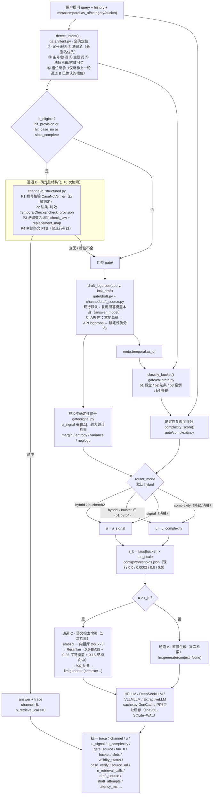

# CA-LegalGate（律核）· 三通道异构法律问答路由系统

> **一句话定义**：CA-LegalGate 是一个**免训练**的中文法律问答系统，用"确定性结构化通道 +
> 门控式直接生成 + 门控式语义检索"三条异构通道，把检索调用压下来的同时不牺牲准确率，
> 并把每一次路由决策、每一条法条来源、每一个案号核验结论都写进可审计的 `trace`。

---

## 0. 本仓库当前状态（诚实清单，2026-09-16 核对）

| 项目 | 状态 | 证据 / 说明 |
|---|---|---|
| 可运行系统（路由 + 三通道 + Gradio / FastAPI 前端） | ✅ 可运行 | `lawgate/router.py`、`lawgate/api/ui.py`、`lawgate/api/app.py` |
| 默认回答模型 | ✅ 本机权重 `models/Qwen3-4B`（魔搭 `Qwen/Qwen3-4B`，约 4B，fp16/CPU） | `configs/base.yaml: llm_backend: hf` + `causal_model: models/Qwen3-4B`；`-LlmBackend deepseek` 可切 API |
| 门控草稿 | ✅ 与回答模型**同一份权重**（共享模型与前缀，prefill 不翻倍） | `configs/base.yaml: draft_model: models/Qwen3-4B`；每次实际来源写进 `trace.draft_source` |
| 结构化知识库 | ✅ 已建库（真实来源） | `data/kb/legal_facts.db`：**188 部法律 / 18281 行 / 16046 条去重**（民法典全量 1260 条；现行有效 16748 / 已废止 985 / 已修订 548）；案号库 **1610 条真实裁判文书**（`data_source=CJWS`） |
| 向量库 | ✅ 已构建（2026-09-15） | `data/kb/vector_build.json`：**42203 文档**（法条 16498 + 文书分块 25705），512 维，**NumpyStore**。⚠️ 本次构建用的是 `HashingCharEmbedder`（离线哈希兜底编码器），不是 bge；语义模型 `models/bge-small-zh-v1.5` 仍在库内，重建时会优先使用 |
| 评测集 | ✅ 已构建并通过自校验 | `data/benchmark/`：**1180 条**（dev 236 / test 944，seed=42），`verify_report.md` 结论 PASS |
| 桶级阈值 | ✅ 当前生效值 | `configs/thresholds.json`：b1 **0.0** / b2 **0.0002** / b3 **0.0** / b4 **0.0**（换 Qwen3-4B 草稿后的现行口径） |
| 实验脚本 / 实验产物 / 过程文档 | ❌ **已从仓库移除**（2026-09-16） | 原 `scripts/`（30 个复现脚本）、`results/`（E0–E6 产物）、`figures/`、`docs/`（deviations/验收/指南等）均已删除。历史结论仅作记录保留在本文 §5，**无法在本仓库内复核** |
| 一键启动脚本 | ⚠️ **当前不可用** | `启动服务.ps1`（及 `.bat`）依赖已删除的 `scripts/serve_one.py`，直接跑会报找不到文件；请改用 §1 的 `python -m` 直启，或补回该脚本。`检查状态.ps1` 不依赖 scripts/，仍可用 |
| GPU | ❌ 无 CUDA，全程 CPU 推理 | 192 token 单条数十秒量级；想快就切 DeepSeek API（1–3 s）或按 §1.4 上 vLLM |

---

## 1. 快速开始（PowerShell）

```powershell
# 0) 进入仓库
cd D:\桌面\lawgate

# 1) 环境变量（三项都必须；import lawgate 时也会自动 setdefault 并读取 .env）
$env:KMP_DUPLICATE_LIB_OK   = "TRUE"   # 不设会 libiomp5md.dll 双运行时直接崩
$env:TOKENIZERS_PARALLELISM = "false"
$env:HF_HUB_OFFLINE         = "1"      # 本机 HF 证书校验失败，强制离线走本地权重

# 2) 建结构化知识库（法条 + 案号真值库 + 沿革 + 词典）
#    产物：data/kb/legal_facts.db、qa_report.md、build_summary.json
python -m lawgate.knowledge.build_sqlite

# 3) 建向量库（法条按"条"聚合 + 文书 300/50 分块 → 编码 → data/kb/chroma/）
#    产物：data/kb/chroma/{embeddings.npy, records.jsonl}、vector_build.json
python -m lawgate.knowledge.build_vector

# 4) 启动演示界面（Gradio 双栏对照 + Trace 面板）→ http://127.0.0.1:7860
python -m lawgate.api.ui

# 4') 或启动 FastAPI 服务 → http://127.0.0.1:8010/docs
python -m lawgate.api.app --port 8010
```

> 首次提问会惰性加载约 8 GB 权重与向量库（1–3 分钟）；重复问题命中内容寻址缓存
> （`data/kb/gen_cache.db`）后约 0.1 s 返回。

### 1.1 环境变量与 `.env`

`lawgate/env_setup.py` 在 `import lawgate` 时自动读取仓库根的 `.env`（**真实环境变量优先，
绝不被 `.env` 覆盖**）。`.env` 含密钥，已被 `.gitignore` 排除，不要提交、不要外传。

| 变量 | 作用 | 默认 |
|---|---|---|
| `DEEPSEEK_API_KEY` | DeepSeek 密钥（只在 `.env`/环境变量里，代码从不写明文） | 无（缺失时 API 模式报 401） |
| `DEEPSEEK_BASE_URL` | API 地址 | `https://api.deepseek.com` |
| `DEEPSEEK_MODEL` | API 回答模型名 | `deepseek-v4-flash` |
| `LAWGATE_LLM_PROVIDER` | 服务形态：`hf` / `deepseek` / `rule`（覆盖 `base.yaml: llm_backend`） | 按 `base.yaml`（当前 `hf`） |
| `LAWGATE_LOCAL_THINKING` | 本机权重思考模式。⚠ Qwen3 模板不显式关闭就会先写一大段 `<think>` 吃光 token 预算，**必须保持关闭** | 关 |
| `LAWGATE_LLM_THINKING` | API 回答的思考模式（门控草稿取 logprobs 时会单独强制开启，与回答无关） | 关 |
| `LAWGATE_LLM_TIMEOUT` / `LAWGATE_LLM_RETRIES` | 单次请求超时（秒）/ 失败重试次数 | `120` / `3` |
| `LAWGATE_DRAFT_SOURCE` | 门控草稿来源：`auto` / `local` / `api` / `none`（回答走本地时草稿=回答模型本身，此开关不参与决策） | `auto` |
| `LAWGATE_MODEL` / `LAWGATE_EMBED` / `LAWGATE_DTYPE` / `LAWGATE_DRAFT_MODEL` | 本地回答模型 / 向量模型 / 精度 / 草稿模型路径 | 按 `base.yaml` |
| `LAWGATE_DOTENV` | 设 `0` = 完全不读 `.env`（复现"无密钥降级"用） | `1` |
| `LAWGATE_UI_MAXTOK` | UI 左右两栏共用的生成长度上限 | `192` |

> **联网口径**：`configs/base.yaml` 的 `allow_network: false` **只约束 HuggingFace 权重下载**，
> 不是"禁止一切联网"——DeepSeek API 调用是设计内的网络行为，由 `llm_backend` 决定。

### 1.2 API 一览

| 端点 | 形式 | 说明 |
|---|---|---|
| `GET /health` | JSON | 服务形态、实际生效的回答/草稿模型、密钥是否读到 |
| `POST /chat` | 一次性 JSON | 主问答入口，返回 `answer + trace` |
| `POST /chat/stream` | SSE | `event: stage` → `delta`* → `done`；`done.answer` 是权威全文 |
| `POST /verify_case` | JSON | 案号四级核验（格式非法 / 不存在 / 案由不符 / 通过） |
| `POST /temporal` | JSON | 法律/条文时效状态查询 |
| `GET /trace/schema` | JSON | trace 字段说明 |

```powershell
curl.exe -N -X POST http://127.0.0.1:8010/chat/stream `
  -H "Content-Type: application/json" `
  -d '{"query":"《合同法》第52条规定哪些情形合同无效？"}'
```

> 诚实口径：通道 B 没有 token 流（查库拼装，整段一次性 `delta`）；`delta` 只是增量，
> 最终以 `done.answer` 收口。

### 1.3 模型与配置

`configs/base.yaml` 现行关键配置：

```yaml
llm_backend: hf                # hf（本机权重，默认）| deepseek | vllm | rule | auto
causal_model: models/Qwen3-4B  # 回答模型（魔搭 Qwen/Qwen3-4B，标准 transformers 架构）
draft_model: models/Qwen3-4B   # 门控草稿：与回答模型同一份权重
dtype: float16                 # CPU 上必须 fp16（fp32 要 ~16 GB）
local_thinking: false          # Qwen3 必须显式关思考，否则正文被 <think> 吃光
k_draft: 20                    # 门控草稿取前 20 个 token 的 logprob 分布
signal: margin                 # margin | entropy | variance | neglogp（越大越该检索）
max_new_tokens: 192
```

本地模型自动解析顺序（`lawgate/config.py`）：`models/Qwen3-4B` →
`models/fuzi-mingcha-v1_0`（夫子·明察 6.7B，ChatGLM 底座，需权重落盘后才可用；
`lawgate/compat_chatglm.py` 兼容层仍在）→ `models/qwen2.5-1.5b/0.5b-instruct` →
HF repo id → HF 缓存快照。目录须同时有 `config.json` 与真实权重才算可用。

**API 模式注意**：回答切 DeepSeek API 时，门控草稿会另挑本地模型（首选同样是
`models/Qwen3-4B`）。API 自身的 logprobs 不能当草稿源——思考模式下的分布实测塌缩到
≈0（u 全在 0.0000–0.0012），没有区分度；来源链逐次尝试并留痕到
`trace.draft_source` / `draft_attempts`。

### 1.4 想更快

| 方案 | 单条 192 token | 代价 |
|---|---|---|
| 现状：CPU + transformers fp16（4B） | 数十秒 | — |
| `-LlmBackend deepseek`（API） | **1–3 s** | 联网 + 按 token 计费 + `.env` 密钥 |
| 消费级 GPU + `llm_backend: vllm` | 约 2–7 s（估算） | 需 CUDA 设备与 vllm 依赖；本机无 CUDA，未实测 |
| UI 演示时 `-UiMaxTokens 80`（`LAWGATE_UI_MAXTOK=80`） | 按比例缩短 | 只改演示长度，两栏同改、口径一致 |

---

## 2. 架构（与 `lawgate/router.py` 一一对应）



### 三种门控模式（`RouterOptions.router_mode`）

| 模式 | 含义 | 用途 |
|---|---|---|
| `hybrid`（**默认**） | b2 用神经信号，b1/b3/b4 用确定性复杂度评分 | E0 分桶结论：神经信号只在 b2 有效 |
| `signal` | 全部桶用神经信号 | 消融对照（汇总口径是红灯） |
| `complexity` | 全部桶用复杂度评分 | 降级方案 / 消融对照 |

> 关键点：不论用哪种信号，**τ_b 始终逐桶校准**，运行时从 `configs/thresholds.json` 读取。

---

## 3. 仓库结构（当前真实状态）

```
lawgate/                        免训练三通道法律问答路由系统（v0.1.0）
├─ config.py                    Settings：路径、模型候选链、dtype、门控/生成参数、provenance() 环境指纹
├─ env_setup.py                 环境变量引导（KMP/TOKENIZERS/HF_HUB_OFFLINE）+ 自动读 .env，须在 import torch 前生效
├─ compat_chatglm.py            ChatGLM 系旧模型兼容装载层（fuzi-mingcha 兜底用）
├─ router.py                    LegalGateRouter + RouterOptions（hybrid 门控 + A1–A4 消融开关 + answer()/answer_stream()）
├─ cache.py                     GenCache：内容寻址生成/草稿缓存（sha256，SQLite + WAL，线程安全）
├─ gate/
│   ├─ intent.py                全确定性意图检测 + 槽位抽取 + 槽位继承
│   ├─ draft.py                 DraftGenerator：复用同一后端取前 k 个 token 的 logprob
│   ├─ signal.py                四个 [0,1] 不确定性信号（越大越该检索）
│   ├─ complexity.py            确定性复杂度评分（b1/b3/b4 的闸门）
│   └─ calibrate.py             桶级阈值校准 calibrate()/load_taus()
├─ channel/
│   ├─ b_structured.py          ChannelB.run()：P1 案号 / P2 法条+时效 / P3 法律效力 / P4 主题 FTS
│   ├─ b_temporal.py            TemporalChecker：check_law / check_provision / replacement_map
│   ├─ b_case_verify.py         CaseNoVerifier：案号四级判定
│   ├─ c_semantic.py            Retriever：惰性加载编码器与向量库，search/retrieve
│   ├─ draft_source.py          DraftSourceChain：门控草稿来源链（local/api/rule），逐次尝试留痕
│   ├─ deepseek_llm.py          DeepSeek API 后端：整段/流式(SSE)/草稿 logprobs、人话报错与退避重试
│   └─ llm_base.py              HFLLM / VLLMLLM / ExtractiveLLM + get_llm() 降级链
├─ knowledge/
│   ├─ schema.sql / schema_ext.sql   法条/FTS/案号库/文书/沿革/词典 + 溯源扩展表
│   ├─ flk_parser.py            法条解析状态机 + 条号连续性校验
│   ├─ audit.py                 audit_law()：条号连续性 + 往返一致性检查
│   ├─ seed_corpus.py           人工录入的关键条文种子语料（含 SUPERSEDE_MAP/词典）
│   ├─ seed_cases.py            兜底合成案号生成器（仅知识库为空时启用；生产库为真实 CJWS 数据）
│   ├─ judgment_parser.py       案号抽取/解析/入库
│   ├─ ingest_clf.py            Chinese-Laws-folk 数据集导入
│   ├─ build_sqlite.py          建库主流程 + qa_report.md + 人工抽验清单
│   ├─ build_vector.py          向量库构建（法条按条聚合、文书 300/50 分块）
│   ├─ store.py                 NumpyStore / ChromaStore 双后端 + get_store() 自动降级
│   ├─ embed.py                 BGEEmbedder（bge-small-zh-v1.5）+ HashingCharEmbedder 离线兜底
│   ├─ rerank.py                BM25 + 字符覆盖 + 条号/案号结构命中
│   └─ risk_terms.py            影响结论的词表（失效提示语/拒答标记/停用词）
├─ eval/
│   ├─ benchmark.py             评测集构建器（1180 条）
│   ├─ metrics.py               机械代理判分（acc/rr/lac/tvc/case_pass/invalid_law_cited…）
│   ├─ baselines.py             6 个方法统一接口（neverrag/alwaysrag/targ/complexity/legal_llm/legalgate）
│   ├─ run_exp.py               实验框架 RunContext + run_method() + 分片合并（库形态，无 CLI）
│   ├─ io.py                    划分装载/结果落盘 + 图注 stamp_footer()
│   ├─ stats.py                 配对 bootstrap + Wilcoxon + Cohen's d + Holm 校正
│   └─ plotting.py              论文级出图（CJK 字体、溯源图注）
└─ api/
    ├─ app.py                   FastAPI：/health /chat /chat/stream(SSE) /verify_case /temporal /trace/schema
    └─ ui.py                    Gradio 双栏对照（流式）+ Trace 面板 + 演示预设

configs/                        base.yaml（运行配置）+ thresholds.json（桶级阈值 τ_b）
data/raw/                       种子法条原文（14 部 .txt，含刑法）+ sources.json 溯源 + sources/chinese-laws-folk/
data/judgments/                 真实裁判文书原始 JSON（4 类案由）
data/kb/                        legal_facts.db、chroma/（向量库）、gen_cache.db（生成缓存）、
                                qa_report.md、build_summary.json、vector_build.json、manual_audit.csv、
                                各导入/抓取报告 + hf_modules/（ChatGLM 远程代码缓存）
data/benchmark/                 评测集 1180 条：all/dev/test.jsonl + dev_calib/test_e1/test_e4/
                                test_multiturn/temporal_trap/case_no_verify.jsonl + counts.json +
                                verify_report.md + construction_log.md + kappa_report.md（模拟标注员）+
                                intent_cases_v1.json + subsets_manifest.json + simulated_annotators/
data/external/                  LawBench/（第三方基准，.gitignore 排除）+ xingfa_raw.json
models/                         Qwen3-4B/（默认回答+草稿模型）+ bge-small-zh-v1.5/（语义编码，512 维）
启动服务.bat / 启动服务.ps1      一键拉起 Gradio + FastAPI（⚠ 依赖已删除的 scripts/serve_one.py，见 §0）
检查状态.ps1                     一键诊断：端口占用、双服务探活、/health 实际模型、知识库与权重是否齐全
```

> ⚠️ 原 `scripts/`（实验流水线、自检、下载工具等 30 个脚本）、`docs/`（deviations/验收/
> 复现指南）、`results/`（E0–E6 产物）、`figures/` 已于 2026-09-16 全部移除。
> `lawgate/eval/` 的实验代码仍在（库形态），重跑实验需自行编写驱动脚本。

---

## 4. 数据资产

### 4.1 结构化知识库（`data/kb/legal_facts.db`，2026-09-13 建库）

- **法条**：188 部法律 / 18281 行 / 16046 条去重（《民法典》全量 1260 条）。
  `validity_status`：现行有效 16748 / 已废止 985 / 已修订 548。
  - 主体 175 部现行法来自开源数据集 **Chinese-Laws-folk**（`source_db=CLF`，
    `ingest_provenance` 标 `CLF_DATASET/UNVERIFIED`）；
  - 另 13 部（含 7 部已废止法：合同法/物权法/侵权责任法/婚姻法/继承法/收养法/担保法）
    来自**中国人大网官方全文页** + **laws-data** 数据集，全部 `VERIFIED`、往返一致率 1.0。
  - 已知缺口：刑法、刑事诉讼法、个人信息保护法、专利法等核心大法**未入库**
    （`data/raw/刑法.txt` 与 `data/external/xingfa_raw.json` 已落盘，待导入）。
- **案号库**：1610 条真实裁判文书（ModelScope `qazwsxplkj/cn-judgment-docs`，
  中国裁判文书网公开文书第三方整理版；民间借贷/劳动争议/房屋租赁各 500、离婚 110），
  `data_source=CJWS`，带真实案号、法院、案由、裁判日期、原文与来源链接。

### 4.2 向量库（`data/kb/chroma/`，2026-09-15 构建）

`vector_build.json`：**42203 文档**（法条 16498 + 文书分块 25705，来自 1610 篇真实文书），
512 维，NumpyStore，CPU 28.4 s。
⚠️ 本次构建的编码器是 `HashingCharEmbedder`（离线哈希兜底），不是 bge；
`models/bge-small-zh-v1.5` 仍在库内，`build_vector` 重建时优先使用语义模型。

### 4.3 评测集（`data/benchmark/`，1180 条，seed=42）

| 类别 | 条数 | 说明 |
|---|---|---|
| concept 概念 | 200 | need_retrieval 正例比例目标 0.4 |
| provision 法条 | 260 | 一条一题无重复（现行有效去重条文 14843 中取材） |
| case 案例 | 200 | 金标来源=真实文书链接 |
| multi-turn 多轮 | 300（100 组×3 轮） | 以组为单位不跨 dev/test 划分 |
| temporal_trap 时效陷阱 | 120（T1–T4 各 30） | 主打卖点的评测载体 |
| case_verify 案号核验 | 100（V1 30/V2 30/V3 25/V4 15） | 按核验器四级判定构造 |
| **合计** | **1180**（dev 236 / test 944，分层 20/80） | `verify_report.md` 结论 PASS |

子集：`dev_calib` 144（校准）、`test_e1` 300（消融口径）、`test_e4` 60（多轮 20 组）。
`counts.json` 含全部构造口径与逐项缺口标注（如部分已废止法的目标替代条文不在语料内，
对应 `golden_provisions` 宁缺毋滥留空）。

---

## 5. 历史实验结论（仅作记录，产物已删除）

> ⚠️ 以下数字来自 2026-09-12 的实验轮次，口径三件套：**回答 = DeepSeek API
> `deepseek-v4-flash`（关思考）、门控草稿 = 本机 Qwen2.5-0.5B、max_tokens=192**。
> 原始产物（`results/`、`figures/`）已随 2026-09-16 的清理删除，**无法在本仓库复核**；
> 且与现行配置（本机 Qwen3-4B 回答 + 同权重草稿）口径不同，**不得并排引用**。

| 实验 | 结论 |
|---|---|
| E1 主对比（6 方法 × test 全量 944） | **核心断言 PASS**：legalgate acc **0.6144** vs Always-RAG 0.5551（配对 Wilcoxon p=0.00205，Holm 校正后显著更优），检索调用率 **0.09**（降 91%）；通道分布 B 568 / A 291 / C 85 |
| E2 消融（A1–A4 × test_e1 300） | 通道 B 是准确率主要贡献源（关掉后 acc 0.7433→0.3233）；该校准点下单 τ 与神经信号选择无实质影响（如实报告） |
| E3 多轮（test_e4 60） | **负结果**：legalgate 总体 0.4167 低于基线；槽位继承在离线协议下不触发（error_rate 1.0）；多轮是当前最弱一环 |
| E5 时效陷阱（120 条） | **主打卖点成立**：TVC **0.9333** vs Always-RAG 0.35；引用失效法率 0.0333 vs 0.6417 |
| E6 案号核验（100 条） | P=R=F1=1.0（**构造性满分**：子类按核验器判定生成，不是真实裁判文书网的准确率证据） |
| E0 门控信号诊断（dev 236，0.5B 口径） | 红灯 + 辛普森悖论：四个神经信号汇总 AUC 均 <0.60，分桶后仅 b2 有效（0.82）→ 默认路由改 hybrid |

单轮吞吐历史指纹（仅算力预算参考）：API 后端单条 192 token 约 1–3 s；
本机权重后端 CPU 逐 token 解码为数十秒量级。

---

## 6. 限制与诚实声明

1. **评测标签全部规则化生成，不是人工标注**：本环境没有任何人工标注员；
   `need_retrieval` / `golden_answer` / `gold_pass` 均为程序生成，
   条目的 `annotators=['A','B']` 是占位字段。
2. **`kappa_report.md` 的 κ 来自模拟标注员**（噪声率 0.12 的程序化假投票），
   只证明 κ 流水线可运行，**禁止**表述为"标注者间一致性已达 κ=X"。
3. **自动判分是机械代理判据**（lexical/structural proxy，见 `lawgate/eval/metrics.py`），
   不是人工判定也不是 LLM 裁判；对"是否引用了正确法条/是否识别失效"测得准，
   对"答案表述质量"只能给近似分。
4. **E6 的满分是构造预期**，且"库里没有但确实存在"的**假阴性率**未直接测量
   （需库外真实案号抽样）。
5. **多轮是已证实的弱项**（历史 E3 负结果）；引用本系统结论时必须同时呈现这一点。
6. **法条覆盖有缺口**：刑法、刑事诉讼法、个人信息保护法、专利法等不在库内
   （原始文本部分已落盘待导入）；CLF 来源的 175 部为 `UNVERIFIED` 口径。
7. **当前向量库由哈希兜底编码器构建**，语义检索质量弱于 bge 构建的版本；
   涉及通道 C 的表现评估需标注编码器口径。
8. **历史实验数字与现行配置不可比**：E0–E5 是在"API 回答 + 0.5B 草稿"口径下取得的，
   现行默认是本机 Qwen3-4B 回答 + 同权重草稿，且 τ_b 已换新值；
   重跑实验前应先观察新草稿源的 u 分布再决定是否重新校准。
9. **实验流水线脚本已移除**：`lawgate/eval/` 仍在但无 CLI 入口，重跑需自建驱动；
   删除前一轮结果由 `results/_prescore_backup/` 等机制保证过可审计性，该目录亦已删除。

---

## 7. 许可证 / 引用 / 致谢

- **许可证**：待补充（`LICENSE` 文件尚未添加）。
- **引用**：待补充。
- **数据与模型致谢**：
  - 法条：[Chinese-Laws-folk](https://github.com/taburise/Chinese-Laws-folk)、
    [laws-data](https://github.com/13098806890/laws-data)、中国人大网官方全文页；
  - 裁判文书：ModelScope `qazwsxplkj/cn-judgment-docs`（中国裁判文书网公开文书整理版）；
  - 模型：Qwen3-4B（魔搭 `Qwen/Qwen3-4B`）、BAAI `bge-small-zh-v1.5`、DeepSeek API；
  - 第三方组件：PyTorch、transformers、sentence-transformers、chromadb、gradio、
    fastapi、jieba、rank_bm25、scikit-learn、scipy、statsmodels、matplotlib；
  - 评测基准参考：`data/external/LawBench/`（见其自带 LICENSE）。
