# 律核（CA-LegalGate）· 所有功能实现的具体流程图

> **这份文档是给谁看的？** 和《小白复现指南》同一位读者：零基础，想搞明白
> "每个功能**具体**是怎么一步步实现的"。本文不重复讲解原理，只做一件事：
> 把每个功能画成**流程图**，并在每个流程旁边标注：
> **对应哪个文件哪个函数 → 中间经过哪些判断 → 产物/结果在哪里**。
>
> 所有图都是**逐行对照源码画出来的**（不是凭印象），文件路径都是仓库相对路径，
> 点开就能定位到对应代码。

---

## 目录

| # | 功能 | 流程图 | 源码位置 |
|---|---|---|---|
| 1 | 知识库构建（法条入库） | §1 | `lawgate/knowledge/build_sqlite.py` |
| 2 | 向量库构建 | §2 | `lawgate/knowledge/build_vector.py` |
| 3 | 一次提问的总路由（核心中的核心） | §3 | `lawgate/router.py` |
| 4 | 意图检测与槽位抽取 | §4 | `lawgate/gate/intent.py` |
| 5 | 通道 B 的四条路径（确定性查库） | §5 | `lawgate/channel/b_structured.py` |
| 6 | 案号四级核验 | §6 | `lawgate/channel/b_case_verify.py` |
| 7 | 时效状态机（法律/法条是否还有效） | §7 | `lawgate/channel/b_temporal.py` |
| 8 | 门控：草稿来源链 + 不确定性信号 + 复杂度评分 | §8 | `lawgate/channel/draft_source.py`、`lawgate/gate/signal.py`、`lawgate/gate/complexity.py` |
| 9 | 桶级阈值校准（τ_b 怎么来的） | §9 | `lawgate/gate/calibrate.py` |
| 10 | 通道 C 语义检索与重排 | §10 | `lawgate/channel/c_semantic.py`、`lawgate/knowledge/rerank.py` |
| 11 | 回答模型：DeepSeek API 后端（含流式） | §11 | `lawgate/channel/deepseek_llm.py` |
| 12 | 回答模型：本地权重后端（离线兜底） | §12 | `lawgate/channel/llm_base.py` |
| 13 | 内容寻址缓存 | §13 | `lawgate/cache.py` |
| 14 | HTTP 接口（含 SSE 流式） | §14 | `lawgate/api/app.py` |
| 15 | Gradio 双栏演示界面（两栏同时流式） | §15 | `lawgate/api/ui.py` |
| 16 | 一键起服务（.ps1/.bat 链路） | §16 | `启动服务.ps1` → `scripts/serve_one.py` |
| 17 | 实验流水线（E1–E6） | §17 | `scripts/run_pipeline.py`、`lawgate/eval/` |

---

## 0. 先看懂一张总图：一次提问的完整旅程

在细看每个功能前，先给一张"鸟瞰图"。下面这张图把 §3–§14 串起来，
**左到右就是时间顺序**，每个方框后面括号里是细看的章节：

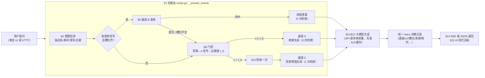

> **一张纸记住系统**：能查库的（法条/案号）→ 通道 B；查不了再让模型"打 20 字草稿"
> 看它心不心虚（u），心虚（u 大）→ 检索一次再答（通道 C），不心虚 → 直接答（通道 A）。
> 每一问都附一份 trace，写清"为什么这么路由、引用了哪条法、链接在哪"。

---

## 1. 知识库构建（法条入库）

**入口命令**（README §1 第 2 步）：

```powershell
python -m lawgate.knowledge.build_sqlite
```

**产物在哪**：`data/kb/legal_facts.db`（法条+案号+沿革+词典的 SQLite 库）、
`data/raw/*.txt`（种子语料落盘）、`data/kb/qa_report.md`（验收报告）、
`data/kb/manual_audit.csv`（人工抽验清单）。

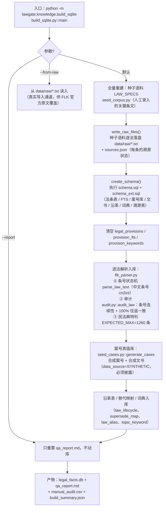

**验收怎么查**：打开 `data/kb/qa_report.md`，每部法律有"覆盖状态（全量/部分）+
审计结果（条号连续、无跳号）"；`manual_audit.csv` 是 120 条抽验清单。
**诚实披露**：当前库内法条全部是 `MANUAL_TRANSCRIPT`（人工录入、未与官方原文逐字比对），
案号库全部 `SYNTHETIC`——这两条必须写进 `docs/DATA_GAP.md`（已写）。

---

## 2. 向量库构建

**入口命令**：

```powershell
python -m lawgate.knowledge.build_vector
```

**产物在哪**：`data/kb/chroma/`（ChromaDB 持久化目录；numpy 兜底则是
`embeddings.npy` + `records.jsonl`）+ `data/kb/vector_build.json`（规模与编码器溯源）。

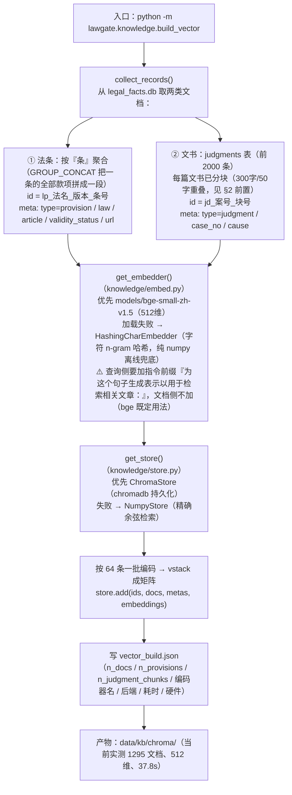

**验收怎么查**：`data/kb/vector_build.json` 里的 `embed_backend` 必须是
`bge-small-zh-v1.5`（若写 `HashingCharEmbedder` 说明语义模型没加载成功，检索召回会明显变差）；
`docs/quickcheck.txt` 里有向量库条数的自检。

---

## 3. 总路由：一次提问怎么走

**源码位置**：`lawgate/router.py` 的 `LegalGateRouter._answer_events()`
（`answer()` 与 `answer_stream()` 的**唯一**实现，非流式只是"整段当一个 delta 发"，
保证界面与接口永远同一个口径）。

**触发路径**：HTTP `POST /chat`（同步）→ `answer()`；HTTP `POST /chat/stream`
（SSE）或 UI 提问 → `answer_stream()`。

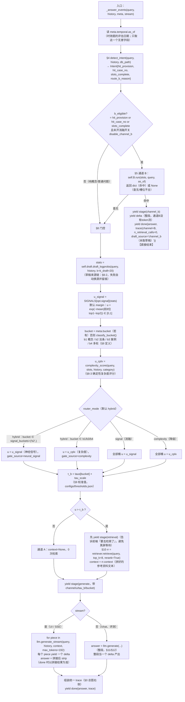

**trace 里每个字段从哪来**（答辩被问到"这个数怎么来的"时对照此表）：

| 字段 | 来源 |
|---|---|
| `channel` | R14 的判定结果（A / C；通道 B 路径写 "B"） |
| `u` / `u_signal` / `u_complexity` | R8（神经信号）、R10（复杂度）、R11–R13（实际采用的那个） |
| `gate_source` | R11 分支里写死的 `neural_signal` / `complexity` |
| `tau_b` / `bucket` | R9（分桶）、R13（校准值 × tau_scale） |
| `complexity_features` | R10 各特征维度逐项值（§8-3 的 7 个特征） |
| `slots` / `slots_inherited` | §4 槽位抽取 + 继承（只继承上一轮**通道 B 确认过**的 topic/law_short） |
| `validity_status` / `case_verify` / `source_url` / `must_show_warning` | 仅通道 B 命中时填充（§5/§6/§7） |
| `draft_source` / `draft_attempts` / `draft_seconds` / `draft_text` | §8-2 草稿来源链的留痕（"这条 u 到底是谁给的"） |
| `n_retrieval_calls` | 通道 A=0，通道 C=1，通道 B=0 |
| `latency_ms` | R0 到 done 的端到端耗时 |

---

## 4. 意图检测与槽位抽取（§3 的第 1 步）

**源码位置**：`lawgate/gate/intent.py::detect_intent()`，**全确定性**（正则+词典，不用 AI）。
词典优先读数据库（`law_alias` / `topic_keyword` 表），读不到用内置兜底表。

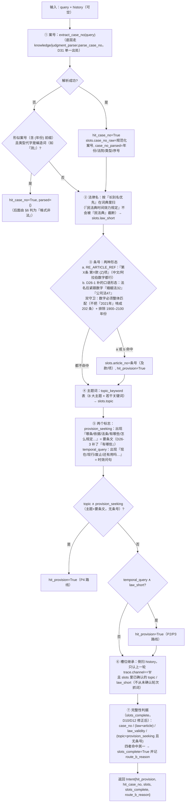

**三个关键修正（为什么不是"直接照手册写"）**：

- **D10**：手册的 `topic and not article_no` 会把"什么是离婚冷静期"（主题词命中）
  误送进通道 B；现在要求主题路线**额外**出现法条索取标记才进 B。
- **D12**：补了"法律名+时效问句"（"担保法现在还有用吗"）→ P3 效力询问路径。
- **D26-1**：口语"婚姻法32"不写"第…条"，补第二条正则 + 两道防误抓守卫。

---

## 5. 通道 B 的四条路径（§3 的 B 分支）

**源码位置**：`lawgate/channel/b_structured.py::ChannelB.run()`，**0 次检索**，
全部是查 SQLite 拼装。**连接按线程惰性建立**（D28：sqlite 连接不能跨线程，
FastAPI 线程池里多线程共享一条连接会直接 `ProgrammingError`）。

四条路径是**顺序短路**的：命中哪条就走哪条，命中即返回；全不命中才返回 `None`（回落到门控）。

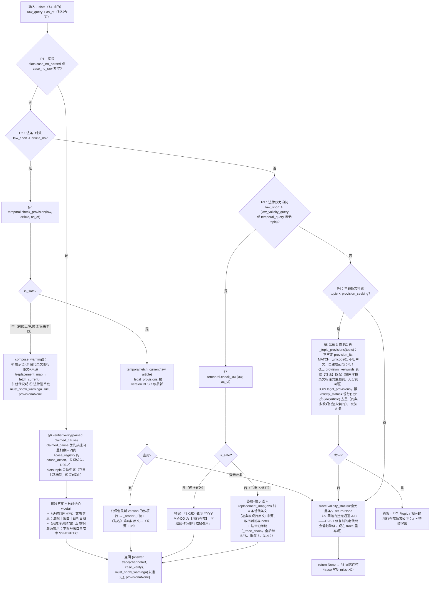

---

## 6. 案号四级核验（通道 B 的 P1）

**源码位置**：`lawgate/channel/b_case_verify.py::CaseNoVerifier.verify()`。
输入是 §4 解析出的 `parsed`（含 year/court_code/case_type/seq_no/normalized/abnormal_marker）
和可选的"用户声称的案由"。

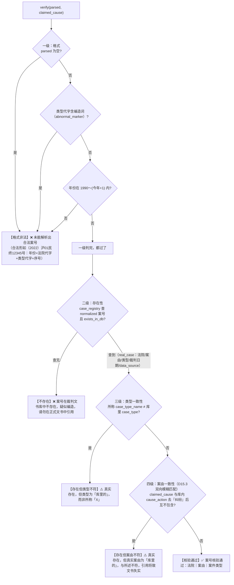

**为什么 4 级是"逐级放宽"而不是一锅端**：每级都能精确指出"错在哪一层"，
答辩时可直接演示（README §1 的演示预设②③就是"编造案号"与"真实案号+错误案由"）。

---

## 7. 时效状态机（通道 B 的 P2/P3）

**源码位置**：`lawgate/channel/b_temporal.py::TemporalChecker`。
核心是 `law_lifecycle` 表（旧法→新法、生效日期、relation=废止/替代/修订、note）。

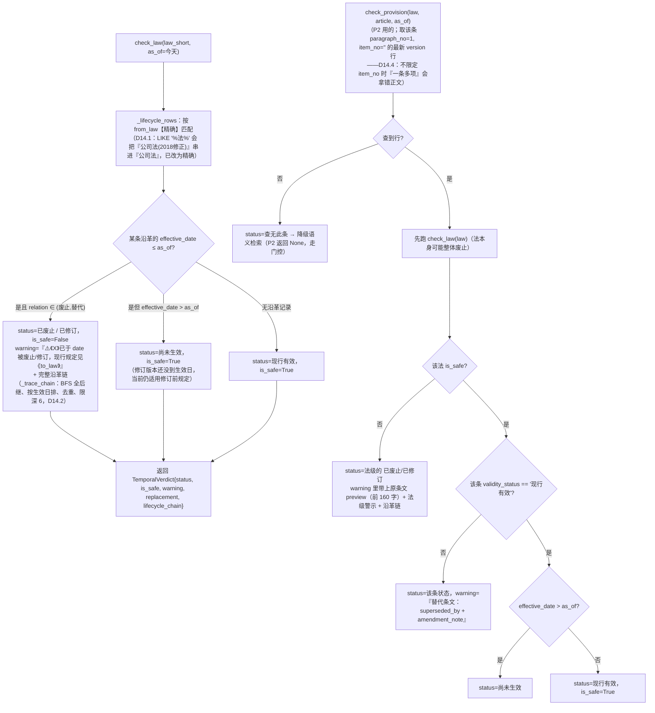

---

## 8. 门控（§3 的核心）：u 从哪来、跟谁比

门控由**三个部件**组成：① 草稿（取 token 级 logprob 分布）、② 神经信号（把分布压成一个 [0,1] 的 u）、
③ 复杂度评分（确定性备选闸门）。三者的关系是**可配置**的（`RouterOptions.router_mode`）。

### 8-1 部件总览

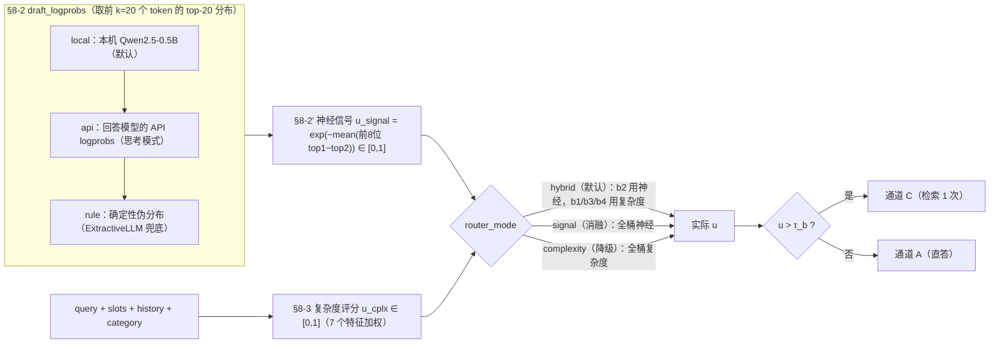

**为什么 b2 用神经、其他桶用复杂度**（`gate/complexity.py` 模块注释里的 E0 结论）：
全桶汇总 AUC 只有 0.557（红灯），但**分桶**看：b2 法条查询 AUC=0.734（信号有效），
b1 概念/b4 多轮 AUC 反向（标签由类别规则决定，与"模型心不心虚"无关甚至反相关）。
这是辛普森悖论——按桶各用各的闸门才是对的。

### 8-2 草稿来源链（回答模型换 API 后 u 到底谁给）

**源码位置**：`lawgate/channel/draft_source.py::DraftSourceChain`（D30 新增）。

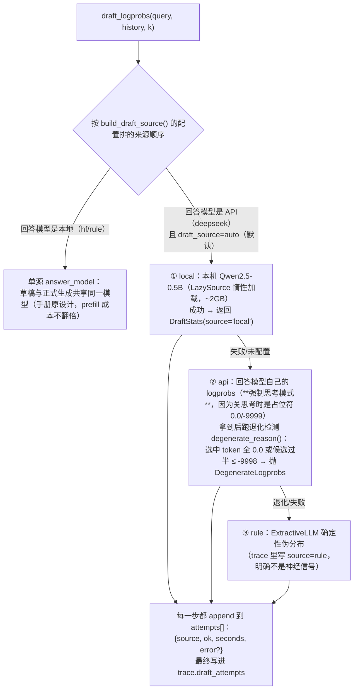

**为什么默认 local 优先而不是"语义最贴的" api**（模块文档里的实测对照）：

| 查询 | u(API 草稿) | u(本机 0.5B) |
|---|---|---|
| 什么是离婚冷静期？ | 0.0000 | 0.0161 |
| 《合同法》第52条… | 0.0001 | 0.0263 |
| （2022）沪01民终12345号… | 0.0012 | **0.3632** |
| 担保法现在还有用吗？ | 0.0000 | 0.0790 |

API 的 logprobs 给的是**套路化推理前缀**的分布（模型在上面极度自信，裕度 9–11 nats），
算出的 u 全贴着 0，**没有区分度**——不是"取不到"，而是"取到了但塌缩了"，更隐蔽。
本机 0.5B 的 u 有量级差异（案号题最高 0.363），因此作为默认。

### 8-3 神经信号的四种口径（`gate/signal.py`）

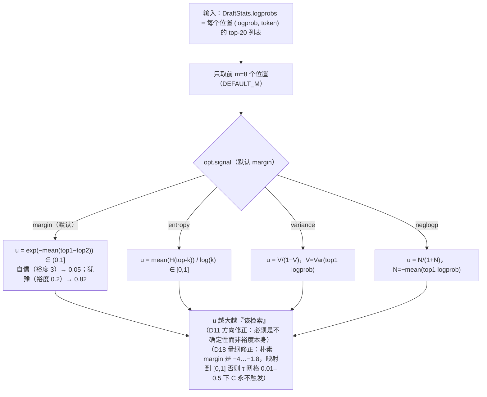

### 8-4 复杂度评分（`gate/complexity.py`，全确定性）

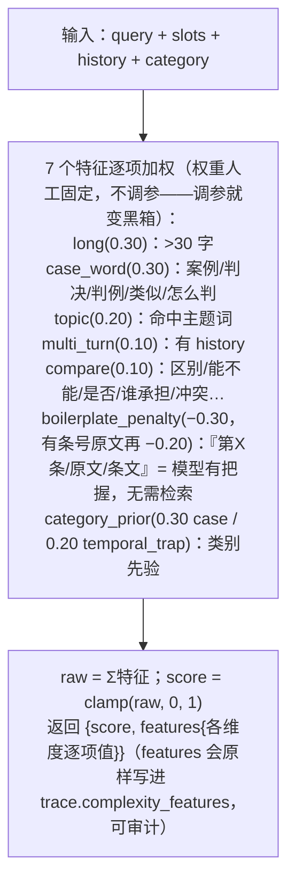

---

## 9. 桶级阈值校准（τ_b 是校准出来的，不是拍脑袋）

**源码位置**：`lawgate/gate/calibrate.py`。dev 集上按桶跑 4 个 τ 网格（0.01–0.50）
的准确率曲线，取**满足精度约束的最大 τ**（D13 方向修正）。

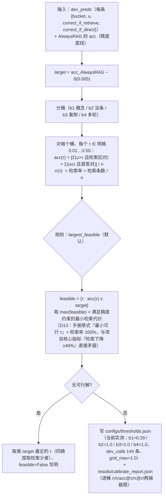

**runtime 怎么用**：`_tau_for(bucket)` = `taus[bucket] × tau_scale`（tau_scale=1.0），
文件缺失时兜底全桶 0.10。

---

## 10. 通道 C：语义检索与重排（§3 的"u > τ_b"分支）

**源码位置**：`lawgate/channel/c_semantic.py::Retriever.retrieve()` +
`lawgate/knowledge/rerank.py::Reranker`。

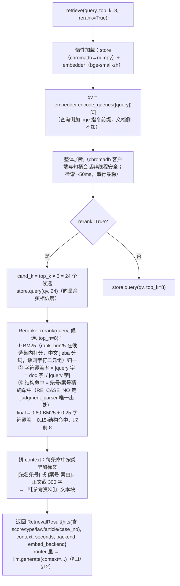

**降级链**（`store.py::get_store`）：chromadb 不可用（受限环境持久化/遥测失败）→
NumpyStore（精确余弦，零依赖）。**两条后端的名称都写进 trace.retrieval.backend**，
避免"结果看着对但实际是兜底"的混淆。

---

## 11. 回答模型：DeepSeek API 后端（当前默认）

**源码位置**：`lawgate/channel/deepseek_llm.py::DeepSeekLLM`（D30 新增；
D31 起传输层用官方 openai SDK，原先手写的 requests+SSE 解析+编码修复全被 SDK 接管）。

### 11-1 整段生成 `generate()`

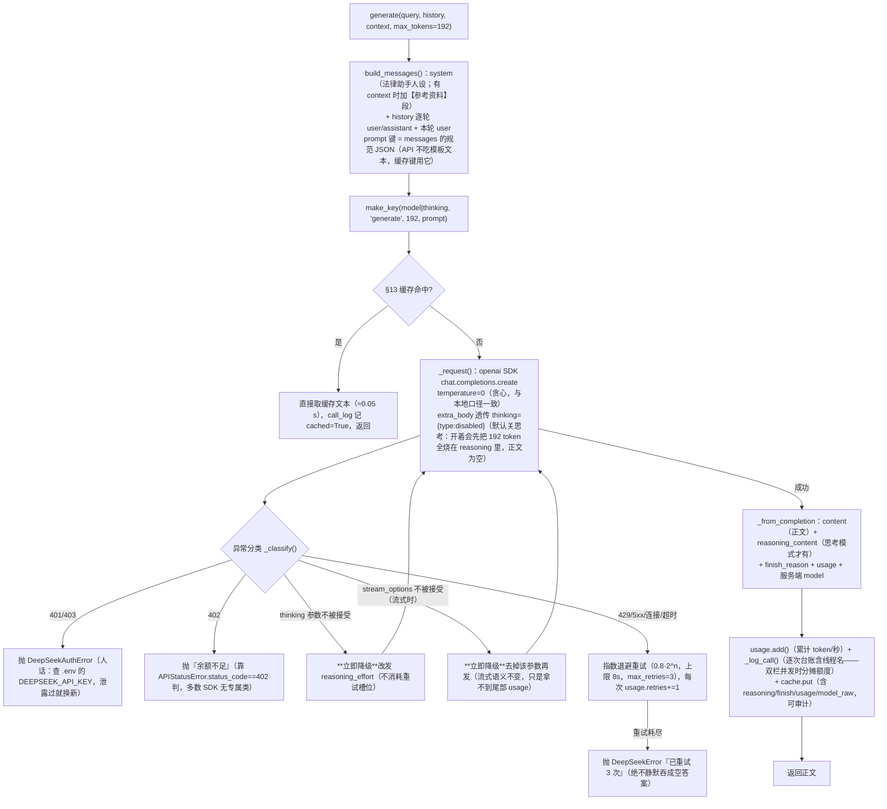

### 11-2 流式生成 `generate_stream()`（真·逐 token）

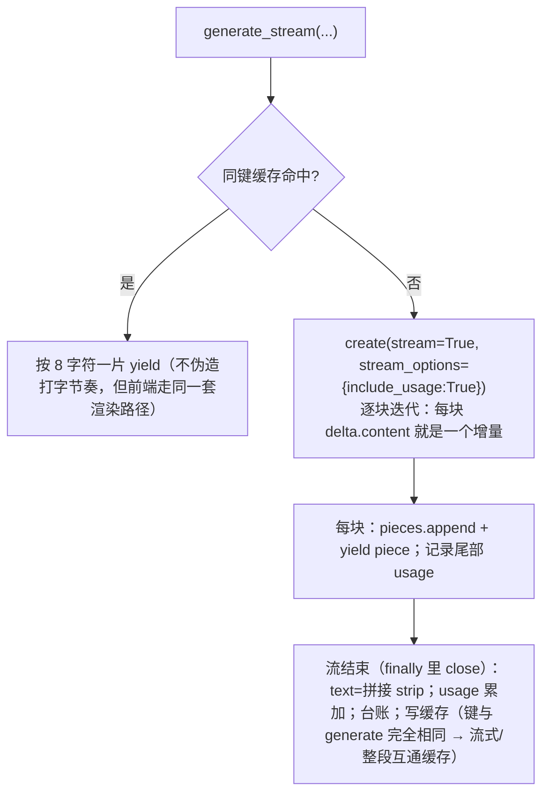

### 11-3 草稿 logprobs `draft_logprobs()`（门控信号来源之一）

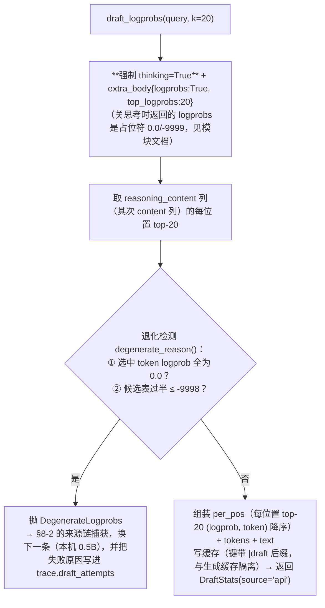

---

## 12. 回答模型：本地权重后端（离线兜底）

**源码位置**：`lawgate/channel/llm_base.py::HFLLM`（6.7B 的 fuzi-mingcha 走
`compat_chatglm` 兼容层；Qwen 走普通 transformers 路径）。

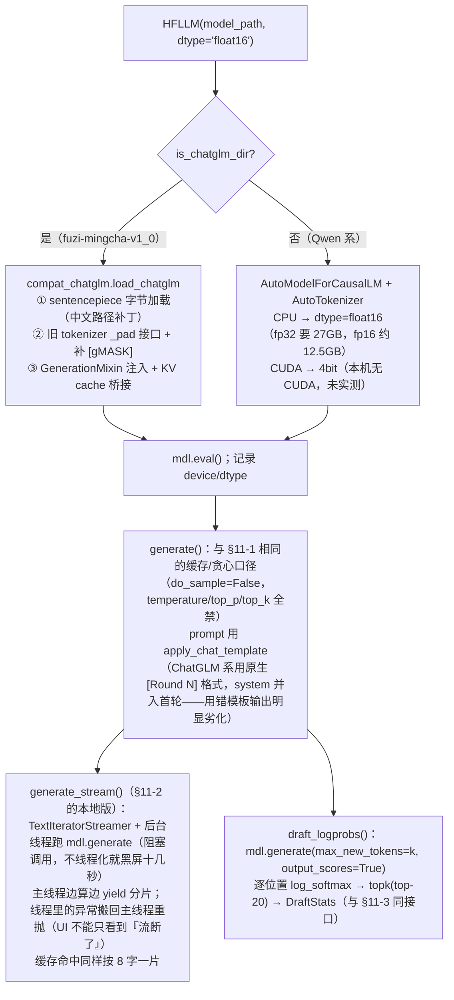

**选择顺序**（`get_llm(prefer)`）：`deepseek`（API，失败**直接抛**，不静默换模型，
防"改了配置跑出另一套结果"）→ `hf`（本地权重）→ `vllm`（部署环境，本机无）→
`ExtractiveLLM`（无权重兜底，结果必须标 `llm_backend=rule_based`）。

---

## 13. 内容寻址缓存（所有后端的公共底座）

**源码位置**：`lawgate/cache.py::GenCache`。

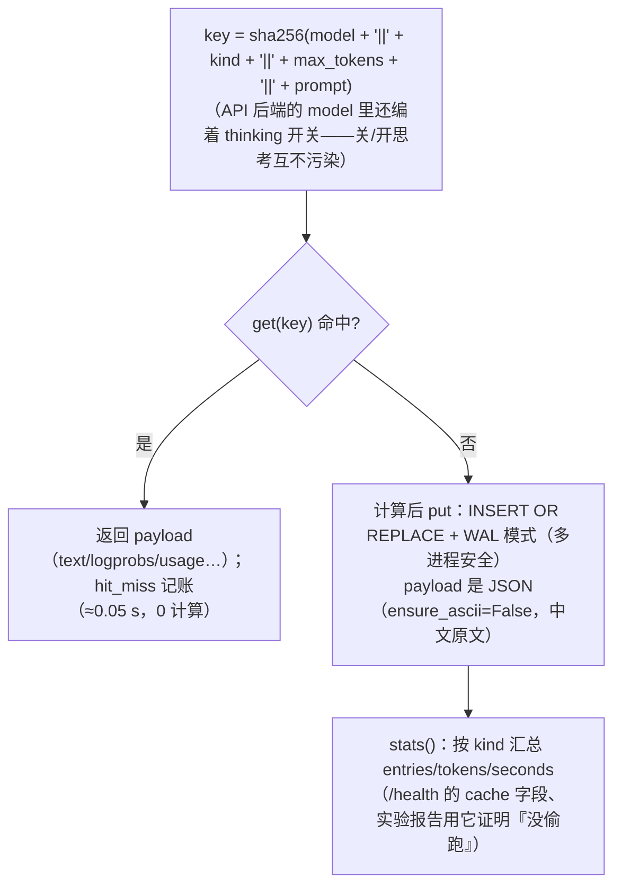

**为什么贪心解码下缓存安全**：同 (模型, prompt, max_tokens) 必然同结果（确定性），
缓存键把这三样全部编进去，换模型/换参数自动失效，且哈希本身可作为"可复现"证据。

---

## 14. HTTP 接口（FastAPI）

**源码位置**：`lawgate/api/app.py`。

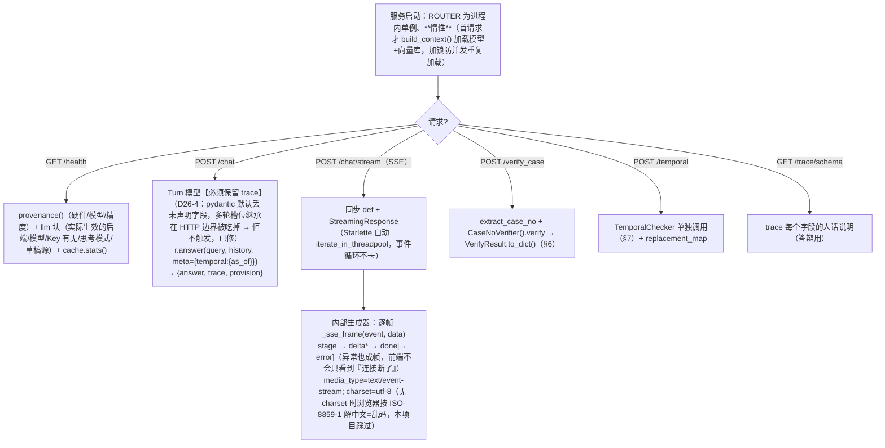

**SSE 帧协议**（`/chat/stream`，前端/`scripts/check_stream.py` 都按这个写）：

| 帧 | 数据 | 说明 |
|---|---|---|
| `stage` | `{stage: channel_b/retrieval/generate, channel, u, tau_b, bucket, decision}` | "正在做什么"，通道 B 命中/检索前/生成前各发一次 |
| `delta`* | `{text: 增量}` | 通道 B 只有**一整段**（查库拼装没有 token 流，不假装逐字）；A/C 逐 token |
| `done` | `{answer: 权威全文, trace, provision}` | **收口以它为准**，delta 拼接可能有首尾空白差 |
| `error` | `{message: "异常类: 信息"}` | 异常也成帧 |

---

## 15. Gradio 双栏演示界面（两栏同时流式）

**源码位置**：`lawgate/api/ui.py::respond_stream()`。

**设计要点**：左栏（无门控直答）与右栏（律核）各要十几秒 CPU 生成。若串行，
"先左后右"会让另一栏一直空白。所以**左栏丢后台线程写队列，右栏事件流在主线推进，
主线每个事件间隙顺手取左栏分片**——两栏同时长出来。

```mermaid
flowchart TD
    U0["用户点『提问』（或预设按钮）"] --> U1["respond_stream(query, history, as_of)（生成器：Gradio 每次 yield 推一帧给浏览器）"]
    U1 --> U2["ensure_loaded()：首问才加载（build_context + RouterOptions(max_new_tokens=gen_max_tokens())<br/>——把生成长度在构造 router 时定死，右栏取值与左栏显式传入的同一个数，两栏同长由构造保证，D28-3）"]
    U2 --> U3["mt = column_max_tokens(router)（右栏真实值，默认 192，-UiMaxTokens 可改，两栏一起变）"]
    U3 --> U4["启动左栏后台线程 _left_worker：<br/>base_llm.generate_stream(query, history, context=None, max_tokens=mt)<br/>每个分片 → queue 写 ('delta', piece)；结束写 ('end')"]
    U4 --> U5["主线循环 router.answer_stream(query, history, meta) 的每个事件："]
    U5 --> U6["_drain_left()（取光队列里的左栏分片）"]
    U6 --> U7{"事件类型?"}
    U7 -- "stage" --> U8["status_html 更新：『⚖️ 通道B 查库中』『🔎 通道C 检索中(u>τ)』『✍️ 通道A/C 生成中』"]
    U7 -- "delta" --> U9["right_buf += 增量"]
    U7 -- "done" --> U10["right_buf = done.answer（权威全文覆盖分片拼接）<br/>trace = done.trace；provision → 尾部『【结构化命中】法名条号列表』"]
    U8 & U9 & U10 --> U11{"节流：距上次 flush ≥0.06s 或事件是 done/stage?"}
    U11 -- "是" --> U12["_snapshot：左栏=left_buf / 右栏=right_buf+provision / trace_html=build_trace_html(trace)（通道/门控来源/决策/u/τ/桶/槽位/继承/时效/核验/来源/延迟/检索命中/草稿来源，D30 起必须显示草稿来源行）<br/>yield (left, right, trace_html, history, 状态行)"]
    U11 -- "否" --> U13["本轮不 flush（缓存命中时会一次涌出大量分片，不节流会打爆 WebSocket）"]
    U12 --> U5
    U13 --> U5
    U5 -- "右栏流结束" --> U14["左栏可能还在生成：while not left_done 继续 q.get(timeout=0.2) 取尾巴（否则界面停在半句话）"]
    U14 --> U15["最终 yield（final=True）：history 追加本轮 {query, answer=右栏, trace}<br/>（带 trace —— 下一轮 HTTP/UI 多轮槽位继承才认它，D26-4）"]
```

**Trace 面板渲染**（`build_trace_html`）：约 20 行表格 + 命中时效/核验风险时顶部
橙色警示条（`must_show_warning`）+ 检索命中 `<details>` 折叠区。

---

## 16. 一键起服务（.ps1/.bat → serve_one.py）

**链路**：`启动服务.bat`（双击，纯 ASCII+CRLF）/ `启动服务.ps1`（UTF-8 BOM）
→ 设环境变量 → `python scripts/serve_one.py --service ui|api --log-file docs/_serve_ui.log`
→ 就绪探测 → 崩溃自动重启（每服务上限 5 次）。

```mermaid
flowchart TD
    P0["双击 启动服务.bat / 运行 启动服务.ps1"] --> P1[".bat 首字符码位法定位 .ps1（cmd 按 CP936 读 .bat，中文路径会乱码 → 用 U+542F=0x542F 筛选，%~dp0 由 cmd 生成走 CP936 无损）"]
    P1 --> P2["设 $env：KMP_DUPLICATE_LIB_OK=TRUE（Anaconda MKL 与 torch 双链接 libiomp5md.dll，不设直接崩）<br/>+ TOKENIZERS_PARALLELISM=false + HF_HUB_OFFLINE=1（HF 权重下载；不影响 DeepSeek API 调用）"]
    P2 --> P3{"端口体检（Get-NetTCPConnection + netstat -ano 兜底——本机前者可能被拦掉看不见占用者）"}
    P3 -- "7860/8010 被外人占用" --> P4["自动让位下一端口并打印新地址（8000 是另一项目长期占用，绝不去杀）"]
    P3 -- "空闲" --> P5["Start-Process 起 python scripts/serve_one.py --service ui --log-file docs/_serve_ui.log"]
    P5 --> P6["serve_one.py 内部：os.dup2 把 stdout/stderr 接到日志文件（**不经过父 shell 管道**——进度条灌满管道缓冲区会把 Gradio 卡死在建服前，D 系列实测）"]
    P6 --> P7["_model_banner()：秒级打印『今天谁在回答』——API 模式：模型/地址/Key 状态/思考模式/草稿源；本地模式：模型路径/精度/13GB 代价提示（防 D21/D29 的口径漂移重演）"]
    P7 --> P8["起 Gradio（7860）或 uvicorn FastAPI（8010）"]
    P8 --> P9["就绪探测：轮询 /health（API）/ 端口监听（UI）直至 200/LISTENING → 打印访问地址"]
    P9 --> P10["崩溃自动重启（每服务上限 5 次）；Ctrl+C 一并停两个服务"]
```

**配套诊断**：`检查状态.ps1`（端口占用者、双服务探活、/health 的实际生效模型、
知识库/权重齐全性、E1–E6 产物落盘情况）。

---

## 17. 实验流水线（E1–E6，学术产出）

**源码位置**：`scripts/run_pipeline.py` + `lawgate/eval/`。

```mermaid
flowchart TD
    E0["run_pipeline.py 启动"] --> E1{"单实例锁 docs/pipeline.lock<br/>（pid + 进程创建时间双校验，PID 复用坑已修）"}
    E1 -- "已有活实例" --> E2["直接 exit 2（防双实例互抢 CPU/缓存，2026-09-11 事故）"]
    E1 -- "无 / 陈旧锁（pid 已死或创建时间对不上）" --> E3["顺序跑（--only 可挑段）：<br/>dev 基线 → 校准（§9）→ E1 主对比 → E5 时效陷阱 → E6 案号核验 → E3 多轮 → E2 消融 → 出图"]
    E3 --> E4["每步失败不阻断并记账（pipeline_steps.json）；子进程 **必须 --inherit-stdio**（沙箱禁命名管道，capture_output 会静默 EPERM）"]
    E4 --> E5["生成全走 §13 内容寻址缓存 + --shards 6 分片顺序跑再 merge（中断只丢当前片；重跑秒过已完成片）"]
    E5 --> E6["产物：results/{e1,e2,e3,e5,e6}/*.jsonl + figures/*.png（每张带 stamp_footer 硬件/模型/日期溯源图注，缺数据画 NO DATA 而非空白）"]
    E6 --> E7["统计（eval/stats.py）：配对 bootstrap 10000 + Wilcoxon + Cohen's d + Holm 校正"]
```

**6 个方法臂**（`eval/baselines.py`，统一接口）：neverrag（不检索）/ alwaysrag（必检索）/
targ（单全局 τ）/ complexity（全复杂度路由）/ legal_llm（人设直答）/ **legalgate（本系统）**。

---

## 附：三张"一眼看懂"的极简图（答辩备用）

**图 A：三通道选择（30 秒版）**

```mermaid
flowchart LR
    Q(提问) --> P{有法名+条号 / 案号 / 时效问法?}
    P -- 有且库里有 --> B[通道B 查库拼装 0检索]
    P -- 没有 --> G{门控 u > τ_b?}
    G -- 否 --> A[通道A 直答 0检索]
    G -- 是 --> C[通道C 检索1次再生成]
```

**图 B：数据流（每问产生什么）**

```mermaid
flowchart LR
    Q(提问) --> T(trace: 通道/u/τ/桶/槽位/继承/时效/核验/来源/延迟/草稿来源/检索命中/检索次数)
    Q --> ANS(answer: 权威全文，done 收口)
    B2(通道B命中) --> PRC(provision: 结构化命中的法条原文列表，UI 尾部展示)
```

**图 C：口径统一（为什么界面和接口不会答出两个答案）**

```mermaid
flowchart TD
    S[_answer_events：唯一实现] --> NA["answer()：stream=False（整段当一个 delta）"]
    S --> SA["answer_stream()：stream=True（逐 token delta）"]
    NA --> HTTP1["POST /chat"]
    SA --> HTTP2["POST /chat/stream"]
    SA --> UI["Gradio 双栏"]
    UI -. "同一 router、同一 RouterOptions(max_new_tokens=192)" .-> SA
    HTTP1 -. "同一份决策逻辑：意图/路由/trace 永远一致，不会『界面走B接口走C』" .-> NA
```

---

## 附：术语速查（流程图里反复出现的词）

| 术语 | 人话 | 在哪用 |
|---|---|---|
| 通道 B | 查字典（直接查 SQLite 法条/案号库拼答案） | §5 |
| 通道 A | 口头快答（模型凭记忆直接写，0 检索） | §3 |
| 通道 C | 先复印资料再作答（向量检索一次，喂给模型） | §10 |
| 门控 | "搜不搜"的闸门：u 跟 τ_b 比大小 | §8 |
| u | 不确定性分（[0,1]，越大越该检索） | §8-3 |
| τ_b | 该桶的校准阈值（dev 集校准，越大检索越少） | §9 |
| 桶 | 问题类别：b1 概念/b2 法条/b3 案例/b4 多轮 | §9 |
| 草稿 | 让模型先打 20 个字看它"心虚不心虚"（取 logprob 分布） | §8-2 |
| trace | 每次回答附带的决策记录（可审计） | §3 |
| 槽位继承 | 多轮对话里只继承上一轮**通道 B 确认过**的 topic/law_short | §4 |
| GenCache | 内容寻址生成缓存（同问第二次 ≈0.05s） | §13 |
| must_show_warning | trace 里的警示开关：命中时效/核验风险时 UI 顶部显示橙色条 | §15 |
| SYNTHETIC | 合成数据标记（案号库/文书不是真实案件，引用必须披露） | §5-P1 |

---

*生成日期：2026-07-10。所有图对照源码（截至 D31）逐行绘制；若后续改动 router/通道/门控逻辑，请同步更新本文对应章节（改动记录照旧写进 `docs/deviations.md` 新编号条目）。*
